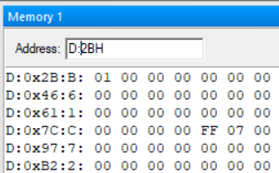

# 实验一、80C51存储器数据传输实验

## 实验目的：
1. 熟悉软件的集成开发环境
2. 掌握单片机软件设计流程，掌握存储器结构及各窗口之间的联系
3. 掌握内部数据存储器、外部数据存储器的数据传送特点和应用；

## 实验内容一：基本指令
1)	用三种方法实现将累加器A内容改为20H

```assembly
ORG 0000H 		
		LJMP MAIN
		ORG 0030H
MAIN:
;方法一使用寄存器寻址
		mov A,#20H
;方法二 使用直接寻址
		mov 0E0H,#20H
;方法三 使用位寻址
		CLR A
		setb 0E5H
	  end
```


2)	将58H位单元置为1，观察内部RAM中2BH内容的变化

```assembly
setb 58H;2BH.0
```

2BH位变成了01H




3)	如果当前状态为有进位、工作寄存器使用区2，请用3种方法设置这种状态

```assembly
;方法1 纯通过位操作
SETB CY
SETB RS1
CLR RS0
;方法2：通过位操作，和加法进位
SETB RS1
CLR RS0
MOV A,#0FH
ADD A,#0FFH
;方法3：通过字节与或操作
MOV A,PSW
ANL A,#11110111B
ORL A,#10010000B
MOV PSW,A
```

4)	编一个小程序将内部RAM中的20H单元的内容送到21H单元并调试

```assembly
 ORG 0000H 		
    LJMP MAIN
    ORG 0030H
MAIN:
    mov 21H,20H
    JMP $
	end
```


5)	用程序将堆栈指针指向60H，然后在堆栈中依次压入01，02，03，04，05五个数，观察哪些单元内容发生了变化，各变为多少？从哪些窗口可以发现这些变化？顺序将堆栈中的五个数放入30H～34H五个单元中，编程实现之。

61H到65H依次存入01-05。依次弹出数据05-01存入34H-30H

```assembly
 ORG 0000H 		
	LJMP MAIN
	ORG 0030H
MAIN:
    MOV A,#60H
    MOV SP,A
    MOV A,#1H
LAB1:
    PUSH 0E0H
    INC A
    CJNE A,#6,LAB1
    POP 34H
    POP 33H
    POP 32H
    POP 31H
    POP 30H
    JMP $
	  end
```


6)	将外部数据存贮器1000H～100FH 16个单元中存放00H～0FH

```assembly
    MOV DPTR,#1000H 
    MOV R1,#10H 
LOOP:MOVX @DPTR,#1234H     
    MOVX A,@DPTR      
    MOV @R1,A 
    INC DPTR 
    INC R1 
    CJNE R1,#40H,LOOP
```

7)	若要求程序从0010H单元开始运行，可用两种方法实现？

```assembly
;方法一，使用LJMP
ORG 0000H
LJMP 0010H
;方法二:使用AJMP
ORG 0000H
AJMP 10H
```


## 实验内容二：数据传送
1)	将**片内**RAM数据区20H为首地址的十六个字节传送到30H为首地址的(**片内**数据区，即：20H～2FH送30H～3FH

```assembly
		ORG 0000H
		LJMP MAIN
		ORG 0030H
MAIN: 	MOV R0,#20H
		MOV R1,#30H
		MOV R2,#16
LOOP:	MOV A,@R0;将数据取到累加器A中
		MOV @R1,A;将数据写到30开始的单元中
		INC R0
		INC R1
		DJNZ R2,LOOP
		SJMP  $
END 
```


2)	将**外部**数据存储器2000H～200FH单元的十六个数传送至**内部**数据存储器的30H～3FH

```assembly
		ORG 0000H 		
		LJMP MAIN
		ORG 0030H
MAIN: 	MOV DPTR,#2000H
		MOV R0,#30H
		MOV R2,#16
LOOP:	MOVX A,@DPTR
		MOV @R0,A
		INC DPTR
		INC R0
		DJNZ R2,LOOP
		SJMP $
		END
```


3)	将外部数据存贮器中首地址为1000H的连续存放的八个数与首地址为1010H的间隔存放的八个数进行交换。

```plaintext
1000   1001   1002   1003   1004   1005   1006   1007
                         ↓↑
1010   1012   1014   1016   1018   101A   101C   101E
```

```assembly
   ORG 0000H 		
		LJMP MAIN
		ORG 0030H
MAIN:	MOV  DPTR, #1000H  ;第一块地址
      MOV  R7,  #10H     ;R7 R6是
      MOV  R6,  #10H     ;第二块地址
      MOV  R2,  #8
LOOP:
      MOVX A, @DPTR      ;取第一地址内容
      MOV  B,  A         ;暂时存放
      PUSH DPH
      PUSH DPL           ;保存地址
      MOV  DPH, R7
      MOV  DPL, R6       ;DPTR = 第二块地址
      MOVX A, @DPTR      ;取第二地址内容
      XCH  A, B          ;交换
      MOVX @DPTR, A      ;存放
      INC  DPTR          ;第二地址要加二
      INC  DPTR          ;变为1012H
      MOV  R7, DPH       ;保存第二地址
      MOV  R6, DPL
      POP  DPL           ;恢复第一地址
      POP  DPH
      XCH  A, B
      MOVX @DPTR, A      ;将首地址1010H的内容放到1000H
      INC  DPTR          ;变为1001H
      DJNZ R2, LOOP
	  end
```


4)	建立一个数字0～9的ASCII码表，表格放在程序存储器区首地址为1000H的十个单元内，编程根据R0中的内容来查表，所得结果存放在寄存器B中，注意R0中的内容不在0～9范围时的处理。

```assembly
		ORG 0000H
		LJMP MAIN
		ORG 0030H
MAIN:	MOV R0,#9
		MOV DPTR,#TABLE
		MOV A,R0
		CJNE A,#10,MAIN1
MAIN1: 	JNC MAIN
		MOVC A,@A+DPTR
		MOV B,A
		SJMP MAIN
		ORG 1000H
TABLE: 	DB 30H,31H,32H,33H,34H,35H,36H,37H,38H,39H
```


