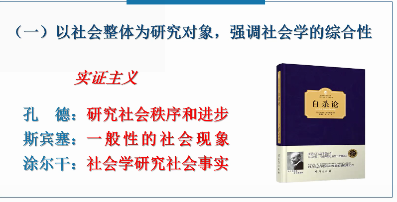
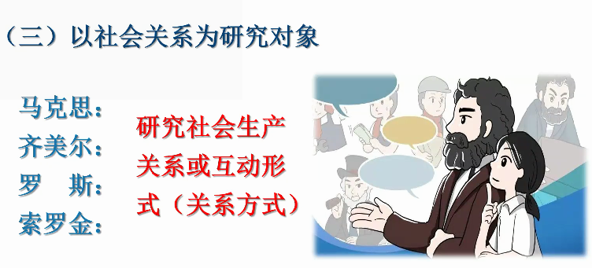
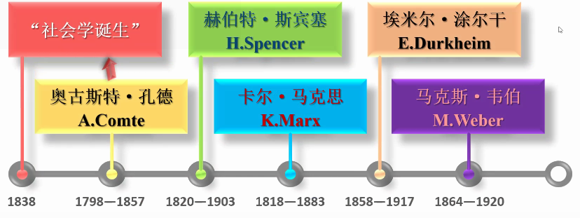
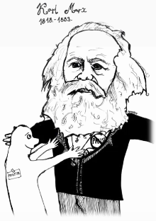
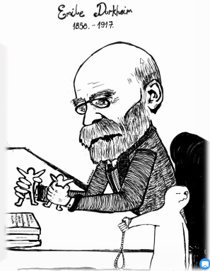
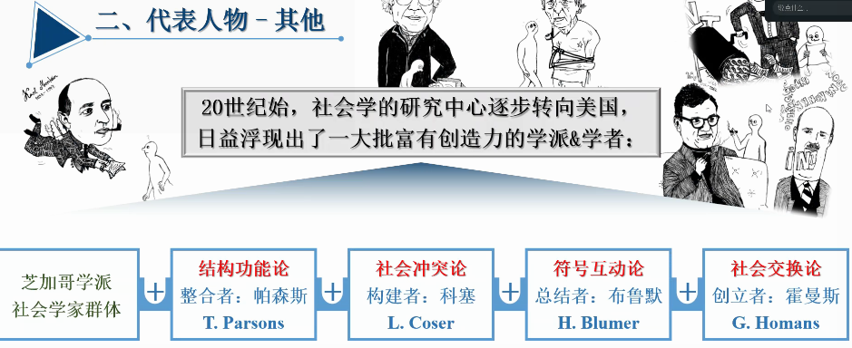
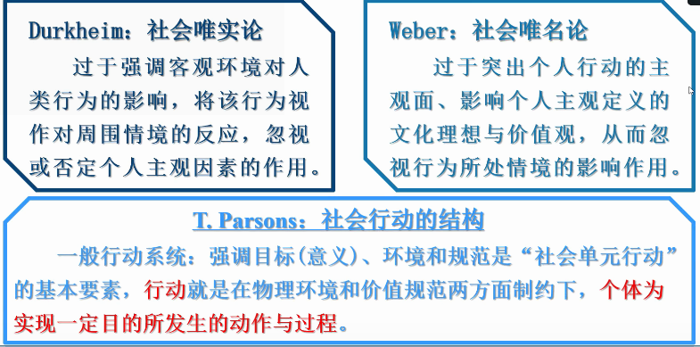
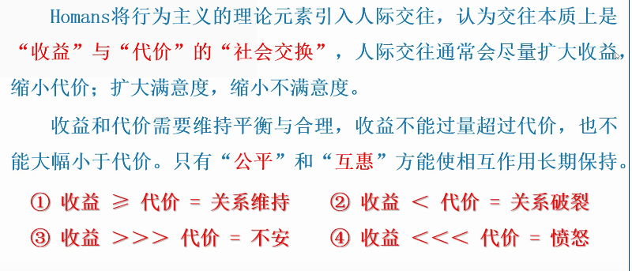

# 第三次授课

## 我们与社会的距离

C. Wright Mills(US) 定义的这个“距离”

> “社会学的想象力”

对个人经验和广阔社会之.间关系的强烈意识，超越个人的狭隘视界，
了解社会、历史和他者，从而最终更好地理解自己的思想和生活。

> The sociological imagination enables us to grasp history and biography
> and the relations between the two within society. This is its task and its promise.

## II 何谓“社会”

### 什么是社会

#### 一、中国古籍中的“社会”

- 社： 地主也，即某一块地方的主人
- 会： 合也，即集会

二者相合指即在一定的地方，于民间节日举行的集会或庆祝活动;
后来发展为第二重意思，指诺志趣相同者结合而成的群体或团体:
社会是许多人为了一个共同目标，聚集在一个地方进行某种活动。

以一定的物质生产活动为基础而相五联系的人类生活共同体。

#### 二、马克思主义论“社会”

社会是人们交往的产物，是各种社会关系的总和;
人类社会区别于动物社会的根本特征是劳动行为;
人类社会是白然界长期发展的产物，亦是区别于白然界的特殊领域。

## III 社会学的研究对象

### 一、国外的社会学研究什么对象

1. 侧重以社会及社会现象为研究对象。西方社会学传统中的主要代表为孔德、斯宾塞、涂尔干等人，形成社会学中的实证义路线。
2. 侧重以个体及其社会行动为研究对象。这种观点在西方社会学传统中的主要代表为韦伯等人，形成社会学中的反实证主义路线。
3. 不属于第一二大类的其他社会学定义则可以看作第三大类，其中有些观点影响不小，但都没有成为社会学发展的主流。

### 二、国内的社会学研究什么对象

1. 侧重以社会为研究对象
2. 侧重以个体及其社会行动为研究对象
3. 其他观点
   1. 剩余说：他学科不研究的“剩余领域”
   2. 学群说：社会学不独立。是-个科学群
   3. 调查说：社会学足研究社会调查的学科
   4. 问题说：社会学的碰究对象是社会间题
   5. 未定说：社会学的碰究对象现在还未定

### 社会学的研究对象

1. 实证主义
2. 反实证主义
3. 以社会关系为研究对象
4. 以社会组织或社会制度为研究对象
   - 托马斯:以社会组织为对象
   - 帕森斯:以社会结构为对象
5. 以社会群体或群体生活为研究对象
    - 福武直:以以的共同社会生活为对象

### 正确把握社会学的研究对象问题

1. 独特性；与其他学科的研究对象相较而言，我们应当认同社会学的研究对象具有独特性。
2. 发展性：社会学研究对象问题上的众说纷纭，是社会学从不成熟走向成熟过程中的必然现象。
3. 多元性：社会学研究对象的范围宽泛，在对社会学研究对象的理解上，不应强求一致。

## IV 社会学的研究领域

### 一、研究对象与研究领域的区别和联系

- 研究对象：指一门科学所以成为该学科的本质规定，即规律性
- 研究领域：指一门学科研究所涉及的范围。不同的社会学科可以从白已特有的视角研究同领域、同一现象:没有哪一个领域能为哪一门学科所垄断，成为后者的专有品。

**联系**：不同的研究领域中确实存在着社会学的研究对象，即别的具体社会科学都涉及但不做专门研究的东西。
社会学的研究对象正是针对不同领域中存在的规律性而进行的理论概括

### 二、社会学的研究领域

- 理论社会学
  - 历史：社会理论发展史、社会思想发展史、社会史
  - 理论：社会结构和过程、社会运行和发展以及人类行为等概括性解释
  - 方法：方法论&具体方法：体现为分析社会现象的视角及具体路径等
- 应用社会学
  - 由众多的针对具体社会现象进行研究的分支社会学构成。
  - 同时，应用社会学的分支学科还在不断增加，持续发展

## VII 社会学知识

知识是人脑对客观世界的反映，器内容是客观的

但是，人脑在对世界反映时并非原原本本地把外界的东西移入，知识<missed>

### 知识的层次

1. 生活经验:最低层次的知识，是对于某一具体事物或具体事物的性质、特点及其与他者、他物间关系的认识;
2. 科学知识:源于对具体事物的认识，以观察为基础，对系列事物进行普遍性概括，继而反映某类事物的情况;
3. 哲学知识:最为抽象的知识，以理性反省为基础,是关于对普遍规律的认识。

## VIII 社会学发展脉络

### 一、社会学的基础研究发展史

### 二、代表人物-A.Comte

创造了社会学这个词，社会学称为“实证哲学”。
认为社会学的目标就是去发现社会的“不可更改的规律”。
他相信,科学的方法可以用来探讨社会学的两个方面。

- 社会动力学：研究世界上各种社会模式如何产生及如何改变。
- 社会静力学：研究社会和部分（团体和制度)的建构方式、部分的功能,以及部分之间的关系;

### 二、代表人物 - H.spencer

社会秩序的不稳定，是一个庞大演化过程中的一部分。
其认为社会是在不断进化的，环境也在不断地变化，任何社会若要生存下去，则组成社会的成份必须不断地去适应环境。

“社会”则类似于达尔文描述的进化中的生物有机体。
其最先提出了关于社会的“适者生存”概念，认为经过自然选择之后，只有最适合社会安排的，最后才能留下来。

### 三、代表任务 - K.Marx

社会进程是不断冲突与变迁的过程，社会发展主要是由经济力量决定的;
人类历史是经济上对立的阶级之间不可避免的相互冲突的过程;
而掌握生产资料的资本家与没有生产资料的无产阶级的冲突，
导致社会主义社会将取代资本主义社会。

社会学理论界公认，
马克思关于社会阶级、经济因素在社会生活中的重要作用、社会中社会生活的异化等观点，是对于社会科学的重要贡献。
马克思被西方社会学界视作社会冲突理论的开创者。

### 四、代表任务 - E.Durkheim

涂尔干相信某种社会的基本力量将个人团结在社会之内:机械团结 VS有机团结;

认为社会事实才是社会学研究的主题，因为它们才是控制个人行为的外来力量;社会事实可能产生在人们的社会互动里，也可能记录在社会风俗习惯及法律里，社会事实也是一种集体意识;

提出“失范”的概念,在失范的状态下，个人的行为不再受公共规范的控制;其相信社会是因其成员享有共同的信仰和价值观而联为一体的;其对自杀现象的研究,成为社会学进行实证研究的典范。

### 五、代表人物 - M.Weber

提出社会科学家在研究现象和得出结论·，只有将他们自己的观点放在一边，才能获得发现理解现象的客观方法，这是一种价值无涉的社会学

建立了社会学研究的模型,并提出社会学必须包括社会行动的研究，即研究人们相互之间行为取向的方式;研究人际互动不仅依赖于客观的定量方法,也要设身处地理解行动者的主观意愿。

其应用了“理想类型”的概念——表示一个特别的社会模式或过程，人们可以用这种模型来检视和比较真实世界中的社会安排;其也是科层制和资本主义研究的挖掘者。

### 六、代表任务 - 其他

20 世纪始，社会学的研究中心逐步转向美国，
日益浮现出了一大批富有创造力的学派&学者；

## 三、社会学在中国的发展