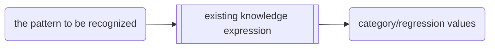
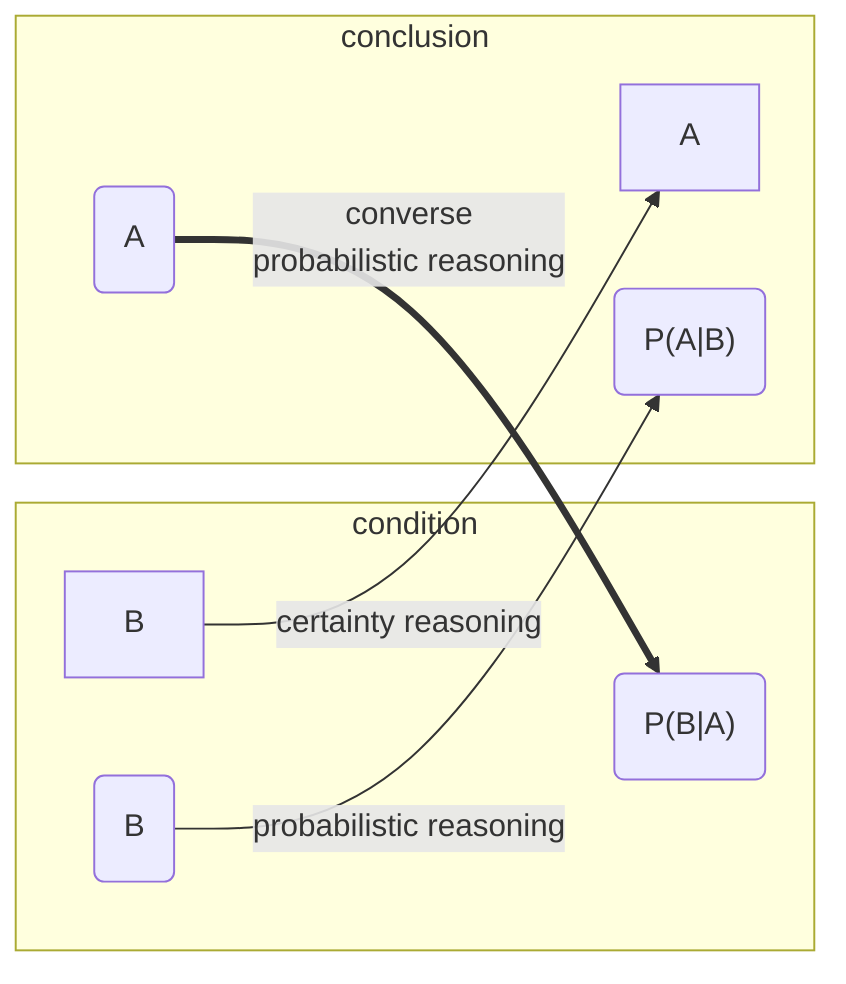

# 01Introduction

For the pattern to be recognized, *Pattern Recognition* aims to 
discriminately decide the **category** to which the pattern belongs 
or predict its corresponding **regression** value 
according to existing knowledge expression

PR is by nature an **inference** process

## Mathematical Expression for category

### function mapping $y=f(x)$映射函数

- x: the pattern to be recognized
- y: category/regression values
- f: existing knowledge expression

* input space: a space of input data
  * space dimension: the demension of input data
* output space: a space ...

## Mathematical Expression for regression

- feature extraction(特征提取): extract the relevant information from the input data
- regressor(回归器): that maps features into regression data

---

# 03Classifiers based on bayes decision theory

## Probabilistic Reasoning

Certainty reasoning vs Probabilistic reasoning

## Principles of Bayes Classifiers

## Commonly Used Bayes Classifiers

- minimum error estimation:  to the class i with max  $P(\omega_i|x)$
- minimun risk estimation:  to the class with min risk $R(\alpha_i | x)$

$$
P(\omega_i | x)=\frac{P(x|\omega_i)P(\omega_i)}{P(x)}
$$

$$
R(\alpha_i | x)= E[\lambda_{ij}]=\sum\limits_{j=1}^{c}\lambda_{ij} P(\omega_j|x)
$$

## Bayesian Classification for Normal Distributions

$$
-\frac{1}{2} (x-\mu_1)^T \Sigma^{-1}_1(x-\mu_1)
+\frac{1}{2} (x-\mu_2)^T \Sigma^{-1}_2(x-\mu_2)
\\
-\frac{1}{2} \ln\frac{|\Sigma_1|}{|\Sigma_2|}
+\ln\frac{P(\omega_1)}{P(\omega_2)}\text{与零比较}
$$

## Probability Density Estimation

- Parameter estimation
  - Maximum likelihood
  - Bayesian Estimation
- nonparameter estimation

## Nearest Neighbor

k-NN

---

# 04Linear Discriminant

## Linear Discriminant Functions and Decision Hyperplanes

multiply nonsingular matrix's columns is zero?

get w(weight vector).find the optimal $w^*$

- perceptron
- LEAST SQUARES METHODS
- SVM

## The Perceptron Algorithm

## Least Squares Methods

## Support Vector Machine

slope: 截距
direction: 方向，斜率

classification interval *d*: margin of classification 分类间隔。
The larger d is better for the larger the classification interval,the fewer the classification errors.

Geometrical interpretation of linear discrinant function 

# 05Nonlinear Classifiers

## Artificial Neural Network & The Backpropagation Algorithm

sigmoid (activation function):[jianshu](https://www.jianshu.com/p/857d5859d2cc)

- $\delta (.)$
- hyperbolic tangent
- Rectified Linear

## Decision Tree

$$
H(Y)=- \sum\limits_{i=1}^{N}p_i\log_2 p_i
$$

---

# 06Introduction of Feature Extraction

## Approaches of Dimensionality reduction

- **Feature extraction**: Usingg the mapping (or transformation) methods to transform the original features to **new features**
- **Feature Selection**: Selecting the most represetative and best performance features from the original features

$$
\text{extraction: }
\bold{x}\rightarrow \bold{x'}=f(\bold{x})
\\
\text{selecttion: }
\bold{x}_{1\times n}\rightarrow \bold{x}_{1 \times m}
$$

## Feature Extraction using K-L transformation

K-L transformation is one common orthogonal(正交,正交矩阵相乘为单位矩阵) transformation

### on unknown samples

If the type(?distribution?) of training samples is unknown,
then the within-class scatter matrix(类内离散度矩阵) of training matrix of training samples is chosen as special matrix.

1. Computing the within-class scatter matrix $Sw_{2\times 2}=\sum(x_i-\mu)(x_i-\mu)^T$
2. Computing the within-class scater matrix's eigenvalues and eigenvectors $|\lambda E-S_w|=0,\lambda_i\vec{\xi_i}=S_w\vec{\xi_i}$（应该选择方便单位化的特征向量：$A\rightarrow \frac{A}{|A|}$）
3. Gennerating the transformation matrix T based on the orthogonal eigenvectors for the top N eigenvalues（如果原来二维，那么通常选取**特征值大**的对应的特征向量，来作为T，注意单位正交化）
   1. 单位化：除以模
   2. 正交化：
4. Computing K-L transformation: $y=T^Tx$

### on known class

1. Computing the within-class scatter matrix
   1. $Sw_i=\sum(x-\mu_i)(x-\mu_i)^T$
   2. $Sw=\sum p_i Sw_i$
2. Computing the eigenvalues and coressponding eigenvectors of within-class scatter matrix $Sw$. Choose bigger one
3. Generating the transformation matrix
   1. 单位化
   2. 正交化
4. K-L transformation$y=T^Tx$

## Principal Component Analysis for unknown typical training samples(主成分分析法)

1. Computing the covariance matrix(协方差) $S_t$
   1. $S_t=\{\sigma_{ij}\},\sigma_{ij}=\frac{1}{N-1} \sum\limits_{k=1}^{N}(x_{ki}-\mu_i)(x_{kj}-\mu_j)$
   2. $S_t=\frac{1}{N-1}S_w=\frac{1}{N-1}\sum(x-\mu)(x-\mu)^T$
   3. 是类内离散度矩阵的$\frac{1}{N-1}$
2. $eig(S_t)$
3. $W=[\xi_1,...]$
4. completing PCA transformation
   1. $y=w^T x_i$
   2. $y=X w$

---

# 07Clustering

- Partitional Clustering
  - K-Series
  - Graph Theory based 
  - ...
- Hierarchical Clustering
  - Top-down Division
  - Bottom-up Agglomerative

## Partitional Clustering分块聚类

- to cluster dataset into several subsets based on one criterion function
- problems
  - The **numbers of subsets**(聚类数) is usually predetermined
    - The choice of initial representative point of each class每个类别的初始代表点，一定要选择好，巧
  - Similarity measurement相似性
    - One form of distance measurement
  - The determination of the criterion function聚类准则函数 for clustering is an optimize process achieving the best classification results

### K-means法

- Euclidean distance $d=\sqrt{x^Tx}$
- minimum of error squre sum（最小误差平方和，使每个样本值与所在类均值的差的和最小）

$$
J=\sum_{i=1}^{N}\sum_{x\in c_i} ||x-\mu_i||^2
$$

1. (开始时选取一个样本作为类中心)dividing into preset C classes and computing the mean of each class
2. (欧式距离)Computing the Euclidean distance to the center of one class and decide which class the sample belongs to
3. (确定样本所属类)assign each sample to the appreciate class based on the rule of minimum Euclidean distance
4. (计算类均值作为新的中心)computing the mean of updated classes
5. (迭代)If the current center of each class is the same as the one of prior same class, then the K-Means algorithm is finished
6. (结束)Otherwise, return to Step2,Step3,Step4, and make a decision whether the condition of finish is satisfied

## Hierarchical clustering分层聚类

Even if the number of classes is unknown,can be used to find the optimal solution according to compactness

- Agglomeractive hierarchical algorithm聚集: **bottom-up**
  1. find each data point of its own class
  2. merge pairs of clusters  class:compute the inter-class distance(类间距离) $d_{ij}$,taking two nearest clusters, and agglomerating them to form one single cluster, so that the total number $k$ of classes is reduced to $k=n-1$
     1. 类间距离原则：最小值（默认）、平均值，最大值
     2. 聚类原则：最小值（默认）、平均值、最大值
  3. Proceeding recursively Step 2 until the desired number of clusters is obtained
- Divisive hierachical algorithm分裂

