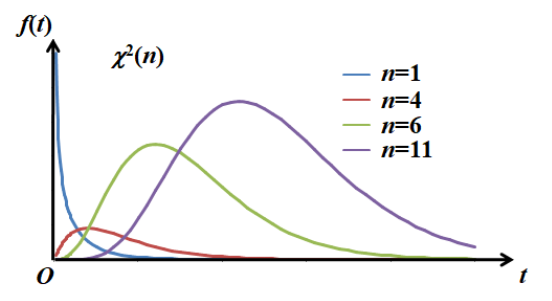
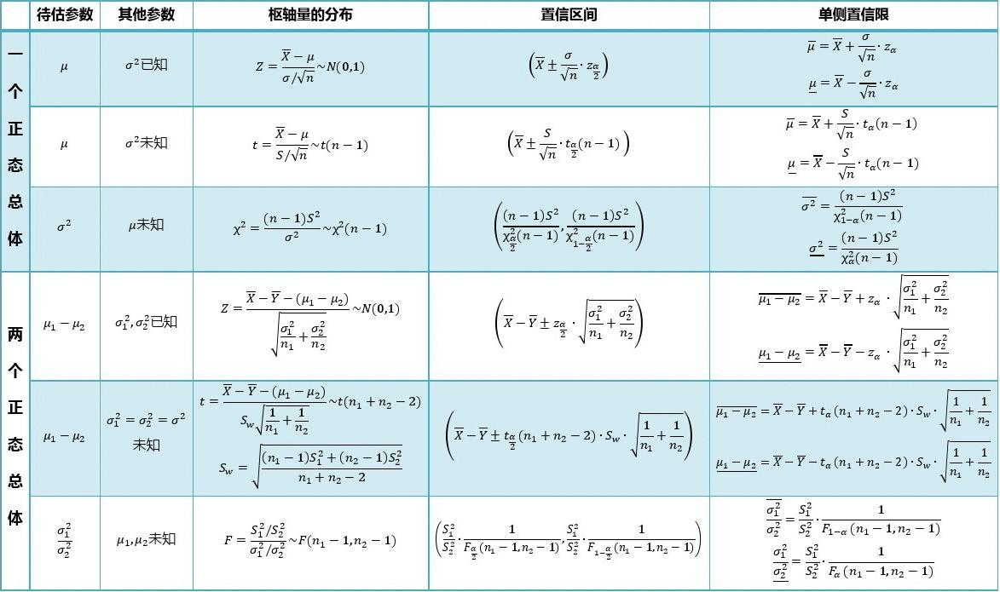
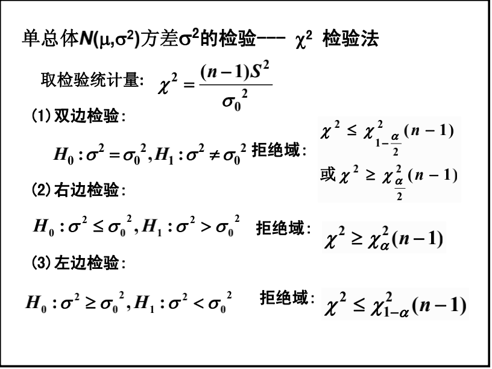

# 数理统计

数理统计是以概率论为基础，以抽样数据来对总体进行推断和预测。其主要内容包括两大类

- 抽样理论和试验设计
- 统计推断（重点介绍）
  - 抽样分布的定义与性质
  - 参数估计
    - 点估计
      - 矩估计法
      - 极大似然估计法
    - 区间估计
  - 假设检验

## 6 样本及抽样分布

### 6.1总体与样本

**抽样**是按照某种原则从所研究的全部对象中抽取部分研究对象

由于*有些研究中研究对象的数量巨大*，*某些试验*是破坏性的

#### 几个基本概念

1. **总体**：研究对象的全体；通常是指研究对象的某项数量指标
2. **个体**：组成总体的每个元素
3. **样本**[^ 样本]：从总体中抽取的部分个体构成的全体
4. **样本容量**：样本中所包含的个体数目
5. **抽样比**：样本容量占总研究对象的比例

[^ 样本]: 数理统计中的样本概念是**放回重复抽样**的结果；对有限总体，当个体总数/样本容量>=10时常用不放回抽样代替放回抽样。

##### 综上

**总体**：$X\sim f(x)$

**样本**：$X_1,\cdots,X_n$满足

1. 独立性：$X_1,\cdots,X_n$相互独立；
2. 同分布性：$X_1,\cdots,X_n$与总体X同分布

称$X_1,\cdots,X_n$为来自总体X的一个*简单随机样本*或*随机样本*或*样本*

其中n称为样本容量,在具体试验中样本$X_1,\cdots,X_n$取得的数值$x_1,\cdots,x_n$称为样本观测值或样本值.

### 6.2抽样分布

#### 6.2.1常用统计量

统计量：样本$X_1,\cdots,X_n$的*不含任何未知参数*的函数$g(X_1,\cdots,X_n)$,称为总体X的一个**统计量**

对应的样本值的函数$g(x_1,x_2,\cdots,x_n)$称为统计量$g(X_1,\cdots,X_n)$的**观测值**

#### 几个常用的统计量

总体：$X$;样本：$X_1,\cdots,X_n$;样本观测值$x_1,\cdots,x_n$。总体X中需要推断的基本信息有：均值、方差等

##### 样本均值

（样本平均数）反映总体均值的信息
$$
\bar{X}=\frac1n\sum\limits_{i=1}^nX_i\\
E(\bar{X})=E(X),D(\bar{X})=\frac{D(X)}{n}
$$
- 其观测值为$\bar{x}=\frac1n\sum\limits_{i=1}^nx_i$

##### 样本方差

反映总体方差的信息
$$
S^2=\frac1{N-1}\sum\limits_{i-1}^n(X_i-\bar{X})^2\\
E(S^2)=D(X)
$$
- 其观测值为$s^2=\frac1{n-1}\sum\limits_{i=1}^n(x_i-\bar{x})^2$

- **样本均方差**（标准差）$S=\sqrt{S^2}$，**其观测值**：$s=\sqrt{s^2}$

- 样本方差是用来反映总体方差的信息。
- **注意**样本方差的分母为$n-1$,而不是$n$。样本方差等于总体方差初期样本容量

##### k阶样本矩

- k阶**原点矩**$A_k=\frac1n\sum\limits_{i=1}{n}X_i^k$，观测值为$a_k=\frac1n\sum\limits_{i=1}^nx_i^k$，用来反映**总体原点矩**的信息

- k阶中心矩$B_k=\frac1n\sum\limits_{i=1}^n(X_1-\bar{X})^k$，观测值为$b_k=\frac1n\sum\limits_{i=1}^n(x_i-\bar{x})^2$，用来反映**总体中心矩**的信息

#### 6.2.2经验分布函数

### 6.2.3 三个重要的抽样分布

统计量的分布称为**抽样分布**

经典的抽样分布：N(0,1)、$\chi^2$-分布、t-分布和F-分布

几个常用的抽样分布：

1. $\begin{array}{ll} N(0,1): & P\left\{Z>z_{\alpha}\right\}=\alpha\end{array}$

2. $\chi^{2}$ -分布 $: \quad \chi^{2}=\sum\limits_{i=1}^{n} X_{i}^{2} \sim \chi^{2}(n), P\left\{\chi^{2}>\chi_{\alpha}^{2}(n)\right\}=\alpha$
3. $t$ 分布 ：$t=\frac{X}{\sqrt{Y/n}}\sim t(n),P\left\{t>t_{\alpha}(n)\right\}=\alpha$
4. $F$ -分布 $: F=\frac{X / n_{1}}{Y / n_{2}} \sim F\left(n_{1}, n_{2}\right), P\left\{F>F_{\alpha}\left(n_{1}, n_{2}\right)\right\}=\alpha$

**自由度**表示分布中独立地随机变量的个数

#### 6.2.3.0$N(0,1)$分布

如果 $X \sim N\left(\mu_{X}, \sigma_{X}^{2}\right)$ 与 $Y \sim N\left(\mu_{Y}, \sigma_{Y}^{2}\right)$ 是统计独立的正态随机变量，那么：

- 它们的和地满足正态分布 $U=X+Y \sim N\left(\mu_{X}+\mu_{Y}, \sigma_{X}^{2}+\sigma_{Y}^{2}\right)$
- 它们的差也满足正态分布 $V=X-Y \sim N\left(\mu_{X}-\mu_{Y}, \sigma_{X}^{2}+\sigma_{Y}^{2}\right)$
- U与V两者是相互独立的。（要求X与Y的方差相等）。

#### 6.2.3.1$\chi^2-$分布

##### $\chi^2-$分布定义

设$X_1,X_2,\cdots,X_n$独立同分布于$N(0,1)$，称
$$
\chi^2=X_1^2+X_2^2+\cdots+X_n^2=\sum\limits_{i=1}^nX_i^2
$$
服从自由度为n的$\chi^2$分布.记为$\chi^2\sim \chi^2(n)$.

- 期望与方差：若$\chi^2\sim\chi^2(n)$，则$E(\chi^2)=n$,$D(\chi^2)=2n$

- 性质
  - （**再生性**）若$\chi^2_1\sim\chi^2(n_2)$,$\chi_2^2\sim\chi^2(n_2)$，且$\chi_1^2$与$\chi_1^2$相互独立，则$\chi_1^2+\chi_2^2\sim\chi^2(n_1+n_2)$

其密度函数为
$$
f(t)=\begin{cases}
\frac1{2^{\frac n2 }\Gamma(\frac n2)}t^{\frac n2-1}e^{-\frac t 2},& t>0\\
0,&t\leq 0\\
\end{cases}
$$

#### 6.2.3.2t-分布

若$X\sim N(0,1),Y\sim\chi^2(n)$,X与Y相互独立，称$t=\frac{X}{\sqrt{Y/n}}$服从自由度为n的t分布，记为$t\sim t(n)$.其密度函数为
$$
f(t)=\frac{\Gamma(\frac{n+1}2)}{\sqrt{n\pi}\Gamma(\frac n2)}(1+\frac{t^2}n)^{-\frac{n+1}2},-\infty<t<+\infty
$$

##### t-分布性质

- f(t)关于纵轴$t=0$对称
- f(t)的计算为N(0,1)的密度函数，即$\lim\limits_{n\to\infty}f(t)=\varphi(t)=\frac 1{\sqrt{2\pi}}e^{-\frac{t^2}2}$,$-\infty<t<+\infty$

#### 6.2.3.3F-分布

若$X\sim\chi^2(n_1)$,$Y\sim\chi^2(n_2)$，X与Y相互独立，称$F=\frac{X/n_1}{Y/n_2}$服从自由度为$(n_1,n_2)$的F分布，记为$F\sim F(n_1,n_2)$.其密度函数为
$$
f(t)=\begin{cases}
\frac{\Gamma(\frac{n_1+n_2}2)(\frac{n_1}{n_2})^{\frac{n_1}2}t^{\frac{n_1}2-1}}{\Gamma(\frac{n_1}{2})\Gamma(\frac{n_2}2)(1+\frac{n_1}{n_2}t)^\frac{n_1+n_2}2},&t>0
\\
0,&t\leq 0
\end{cases}
$$
##### F-分布性质

由F分布的定义可知，若$F\sim F(n_1,F_2)$，则$\frac 1F\sim F(n_2,n_1)$.
$$
F=\frac{X/n_1}{Y/n_2}\Rightarrow\frac 1F=\frac{Y/n_2}{X/n_1}
$$

分位点的定理：$F_{1-\alpha}(n_2,n_1)=\frac 1{F_\alpha(n_1,n_2)}$

### 6.3正态总体的抽样分布

**定理1** 设$X_1,\cdots,X_n$为取自$N(\mu,\sigma^2)$的容量为n的样本，$\bar{X}=\frac 1n\sum\limits_{i=1}^n X_i$,$S^2=\frac 1 {n-1}\sum\limits_{i=1}^n(X_i-\bar{X})^2$.则有

1. $\overline{X}\sim N(\mu,\frac{\sigma^2}n)$，即$\frac{\overline{X}-\mu}{\sigma/\sqrt{n}}\sim N(0,1)$
2. $\frac{(n-1)S^2}{\sigma^2}\sim \chi^2(n-1)$
3. $\overline{X}$与$S^2$相互独立
4. $\frac{\overline{X}-\mu}{S/\sqrt{n}}\sim t(n-1)$

**定理2**：设$X_1,\cdots,X_n$为取自$N(\mu,\sigma^2)$的容量为n的样本，$Y_a,\cdots,Y_{n_2}$为取自$B(\mu_2,\sigma_2^2)$的容量为$n_2$的样本，且两样本独立
$$
\overline{X}=\frac{1}{n_1}\sum\limits_{i=1}^{n_1}X_i,S^2=\frac 1{n_1-1}\sum_{i=1}^{n_1}(X_i-\overline{X})^2\\

\overline{Y}=\frac{1}{n_2}\sum\limits_{i=1}^{n_2}Y_i,S^2=\frac 1{n_2-1}\sum_{i=1}^{n_1}(Y_i-\overline{Y})^2
$$
则有

1. $\overline{X}-\overline{Y}\sim N(\mu_1-\mu_2,\frac{\sigma^2_1}{n_1}+\frac{\sigma_2^2}{n_2})$
2. $F=\frac{S_{1}^{2} / \sigma_{1}^{2}}{S_{2}^{2} / \sigma_{2}^{2}} \sim F\left(n_{1}-1, n_{2}-1\right)$
3. 假设 $\sigma_{1}^{2}=\sigma_{2}^{2}=\sigma^{2},$ 则 $T=\frac{(\bar{X}-\bar{Y})-\left(\mu_{1}-\mu_{2}\right)}{S_{w} \sqrt{\frac{1}{n_{1}}+\frac{1}{n_{2}}}} \sim t\left(n_{1}+n_{2}-2\right)$

## 7参数估计

### 7.1 点估计

#### 7.1.1矩估计

$$
E(X^l)=A_l=\frac{1}{n}\sum\limits_{i=1}^{n}X_i^l
$$

#### 7.1.2最大似然估计

$$
L(\theta)=\prod\limits_{i=1}^{n}p(x_i;\theta)
$$

### 7.2估计量选取的标准

1. 无偏性：估计量的期望等于未知参数的真值
2. 有效性：方差小
3. 相合性：当样本数趋于无穷时，估计量趋于真值

### 7.3区间估计

确定一个区间，使得有比较高的可靠程度相信他包含真值

## 8 假设检验

两类错误

- 第一类错误：以真为假，弃真
- 第二类错误：以假为真，取伪

显著性假设检验考虑的是第一类错误

### 8.2单正态总体的均值和方差的假设检验

