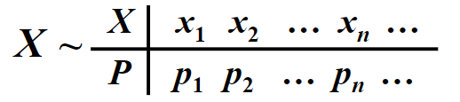
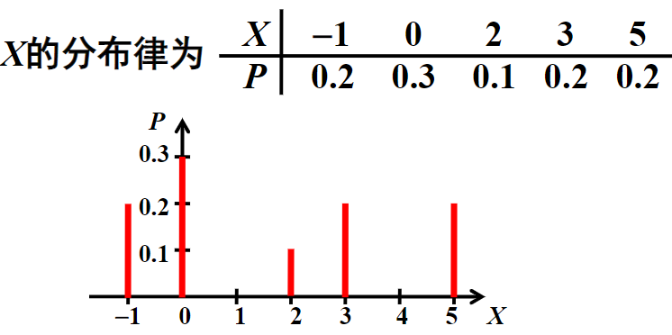

# 概率论与数理统计

这里主要是概率论相关的知识，公式由$\KaTeX$写成

- 常见分布
  - [常见一维离散分布](#3-2-常见的一维离散型分布)
  - 连续型
    - [均匀分布](#均匀分布uniform-distribution)
    - [指数分布](#4-4-指数分布)
    - [正态分布](#4-5-正态分布)

## 前言

（不确定性、不确定性数量化）概率论与数理统计就是不确定性的数量化研究，主要内容为随机现象的统计规律性。主要应用有：天气预报，保险收益，物价问题（抽样的概念），大数据（计算机，概率论，统计学）

### 历史与发展

- 文艺复兴后随着航海事业的发展，意大利开始出现海上保险业务
- 保险行业的发展，随机博弈的发展
- 人们通过对随机博弈现象的分析注意到了它的一些特性

**德·梅耳问题**将一枚骰子掷4次至少出现一个6点的机会比较多而同时将两枚骰子掷24次，至少出现一次双6点的机会却很少$P_1=1-\frac{5}{6}^4=\frac{671}{1296}$

**分赌注问题**甲乙两人决定赌若干局，事先约定谁先赢6局便为赢家，赢家将独自赢得全部奖金。现在两人一共进行了7局比赛，甲赢了3局，乙赢了4局由于某种原因比赛无法继续，此时该如何分配奖金？

**组合概率时期** 计算各种古典概率
1951年德梅耳偶遇了法国**帕斯卡**（Pascal,1623-1662)，就此问题向帕斯卡请教，帕斯卡将此问题与它的好友业余数学家***费尔马***(Fermat,1601-1665)共同探讨，于1654年解决了此问题，并进行了一段话的推广。与此同时荷兰***惠根斯***听说这个问题后也很感兴趣于是潜心研究于1657年发表了*《论掷骰子游戏中的计算》*（概率论最早的著作）

**雅各布家族** *雅各布·伯努利(Jacob Bernoulli,1654-1705)*给出了赌徒输光问题的详尽解法并证明了大数定律的一个定理，1713年（时已逝）出版《猜度术》。侄子尼古拉·伯努利（Nicolaus Bernoulli,1687-1759)提出了著名的圣彼得堡问题（1738）
法国数学家拉普拉斯（Laplace,1749-1827)明确给出了概率的古典定义，并在概率论中引入了更有利的数学分析公式，讲概率论推向一个新的发展阶段，建立了De Mover-Lapalce定理，建立了观测误差理论和最小二乘法，1812年出版*《分析的概率理论》*

**苏俄数学家**1906年俄国数学家马尔科夫(Markov,1856-1922)年提出马尔科夫链
1934年前苏联科学家辛钦(Khinchin,1894-1959)提出了“平稳过程”
柯尔莫哥洛夫(Kolmogorov,1903-1987) 前苏联 《概率论基础》（1933） “概率论的公理化方法

### 授课目标

通过本课程的学习，使学生系统地学习随机变量和初等数理统计的基本理论知识，掌握必要的随机变量分析方法和常规的数理统计方法。在逐步培养学生的抽象思维和逻辑推理能力的同时，加强学生应用随机思想分析问题的能力。

## 一、古典概率

1. 掌握样本空间、随机事件的基本概念和事件的运算关系，学会用概率语言描述实际问题；
2. 理解概率的统计定义和公理化定义；
3. 掌握概率的基本性质并能灵活运用；
4. 理解并掌握古典概率的定义和计算；
5. 理解并掌握条件概率的定义和乘法公式的应用。

### 1-1 随机试验与事件

#### 随机现象

> 一定条件下必然要发生的现象成为**确定性现象或必然现象**

**随机现象**是一定条件下可能出现也可能不出现的现象

**随机试验**指在一次试验中无法确定其具体结果，但在实验之前可预知其全部可能结果的试验。常用大写字母E表示。
随机试验(random trial，简称试验trial)有三大特点：

1. **重复性**：原则上可以在相同条件下重复进行；
2. **随机性**：每次试验将要出现的结果是不确定的，事先无法准确预知；
3. **明确性**：所有的试验结果是可观察的，可事先预知所有可能试验结果。

> 书上为重复性、多样性和随机性

#### 样本空间

- 随机试验的所有可能结果构成的全体称为**样本空间**，常用$\Omega$、S等符号表示。
- 随机试验的每一个可能的结果称为一个**样本点**，常用$\omega$、*e*等符号表示。

样本空间是由样本点构成的全集。样本空间中的元素，即随机试验的每个基本结果称为样本点

#### 随机事件

1. 由部分试验结果组成的集合称为**随机事件**，简称为**事件**。常用大写英文字母A、B、C等表示
    - 随机事件就是样本空间的子集。$\text{事件A发生}\Rightarrow \omega \in A$
2. 几个特殊事件
    1. **必然事件**：样本空间Ω包含所有试验结果，它每次试验中都会发生；
    2. **不可能事件**：空集∅不包含任何结果，它在每次试验中都不会发生；
    3. **基本事件**：由一种可能结果，即单个样本点构成的事件

#### 事件的运算关系

| 运算关系       | 符号表示                           |
| -------------- | ---------------------------------- |
| 事件的包含     | $A\subset B  \ or\  B\supset A$    |
| 事件相等       | $A=B \ \ A \subset B \ A\supset B$ |
| 事件的并（和） | $A\cup B$                          |
| 事件的交（积） | $A\cap B=AB$                       |
| 事件的差       | $A-B$                              |  |
| 互不相容事件   | $A\cap B=\emptyset$                |
| 对立事件       | $\bar{A}$                          |
| 完备事件组     | 如下                               |

完备事件组:设S为试验E的样本空间，B1，B2，…，Bn为E的一组事件。若

1. Bi ∩ Bj=∅ （i≠j且i、j=1，2，…，n）；
2. B1∪B2∪…∪Bn=S，

则称B1，B2，…，Bn为样本空间S的一个完备事件组（划分）。定义在2-1有说明。定义为充要条件，反之也成立

| 随机事件A、B、C                | 记为                                                            |
| :----------------------------- | --------------------------------------------------------------- |
| 至少发生一个                   | $A\cup B\cup C$                                                 |
| 都发生                         | $A\cap B \cap C=ABC$                                            |
| 恰好发生一个                   | $(A\bar{B} \bar{C})\cup(\bar{A} B\bar{C})\cup(\bar{A}\bar{B}C)$ |
| 至多发生两个（至少一个不发生） | $\bar{A}\cup\bar{B}\cup\bar{C}$                                 |
| 至少两个事件发生               | $AB\cup BC \cup AC$                                             |
| A发生且B、C至少有一个不发生    | $A(\bar{B}\cup\bar{C})$                                         |

#### 事件的运算律

1. 关于求和运算  (交集运算)
    1. 交换律$A \cup B=B\cup A$
    2. 结合律$(A\cup B)\cup C=A\cup (B\cup C)=A\cup B\cup C$
2. 关于求积运算  （并集运算）
    1. 交换律$A \cap B=B\cap A$
    2. 结合律  $(A\cap B)\cap C=A\cap (B\cap C)=A\cap B\cap C$
3. 关于混合运算
    - **分配率**
    1. $(A\cup B)\cap C=(A\cap C)\cup (B\cup C)$
    2. $(A\cap B)\cup C=(A\cup C)\cap (B\cup C)$
4. **对偶律**（摩根律）

$$
\overline{A\cup B}=\bar{A}\cap\bar{B},\overline{A\cap B}=\bar{A}\cup \bar{B}.\\
\overline{\bigcup_k A_k}=\bigcap_k \overline{A_k},\overline{\bigcap_k A_k}=\bigcup_k \overline{A_k},
$$

### 1-2 频率与概率

#### 事件的频率

在相同的条件下进行了n次实验，其中事件A发生的次数为$n_A$，比值$\frac{n_A}{n}$称为事件A发生的频率，记为$f_n(A).$,其中$n_A$称为事件A发生的频数
$$
f_n(A)=\frac{n_A}{n}=\frac{事件A发生的频数}{试验总次数}
$$

##### 频率的性质

1. 非负性：$0\leq f_n(A) \leq 1$;
2. 规范性：$f_n(\Omega)=1$;
3. 可加性：$若A_1,A_2,\cdots,A_m为m个两两不相容的事件， \\ 则  f_n(A_1\bigcup A_2\bigcup\cdots\bigcup A_m)=f_n(A_1)+f_n(A_2)+\cdots +f_n(A_m)$

#### 事件的概率

##### 定义1(频率趋近概率)

在相同的条件下进行大量的重复试验，随机事件A出现的频率$\frac{n_A}{n}$将稳定地在某个固定的数值p的附近摆动，称这个稳定值p为随机事件A的**概率**，记为P(A)，即P(A)=p
$$
\lim_{n\to \infty}f_n(A)=P(A)
$$

- 优点：直观易懂
- 缺点：粗糙模糊，不便使用

##### 定义2（概率的公理化定义）

>1933年，前苏联数学家柯尔莫哥洛夫（kolmogorov）提出了概率论的公理化结构，给出了概率的严格定义，使概率论有了迅速的发展

设E是随机实验,$\Omega$为其样本空间，对**E的每一个事件A**赋予一个实数P(A)，称之为事件A的**概率**，如果它满足下列三个条件：

1. **非负性**： 对任意事件A，有$P(A)\geq 0$;
2. **规范性**： 对必然事件B，有$P(S)=0$;
3. **可列可加性**：若$A_1,A_2,\cdots$为可列无限个两两不相容的事件， 则 $P(A_1\bigcup A_2\bigcup\cdots)=P(A_1)+P(A_2)+\cdots$
也就是：

$$
P:A\to P(A),\forall A\subset \Omega ,\lim_{n\to \infty}f_n(A)=P(A)
$$

以上内容在有道云笔记上写成

### 1-3 概率的性质

1. （**空集的概率为零**）$P(\emptyset)=0$.
2. （**有限可加性**）若$A_1,A_2,\cdots,A_n$为n个两两互不相容的事件，则$P(A_1\cup A_2\cup \cdots\cup A_n)=P(A_1)+P(A_2)+\cdots +P(A_n)$
3. （**单调不减性**）设A，B为两个事件，且$A\subset B$,则$P(A)\leq P(B)$，$P(B-A)=P(B)-P(A)$（*减法公式*）
4. 对任一事件A，有$P(A)\leq 1$.
5. （**互补性**）对任一事件A，有$P(\bar{A})=1-P(A)$
6. （**加法公式**）对于任意两个事件A、B，有$P(A\cup B)=P(A)+P(B)-P(AB)$

加法公式的**推广**：$P(A\cup B\cup C)=P(A)+P(B)+P(C)-P(AB)-P(AC)-P(BC)+P(ABC)$

性质3 的使用示例：$P(AB)\leq P(A)=0\ \Longrightarrow P(AB)=0$

### 1-4 古典概型

古典概率模型(classical probability model),简称古典概型，又称等可能概率模型

#### 古典概型（等可能概型）的定义

1. 试验的样本空间只包含有限个元素.  **有限性**
2. 试验中的每个基本事件发生的概率相同 **等可能性**

设试验E为古典概型，不妨设其样本空间为$\Omega=\{e_1,e_2,\cdots,e_n\}$，由（2）有$P({e_1})=P({e_2})=\cdots =P({e_n})=nP({e_i})$，由$P(\Omega)=1$,得$P({e_i})=\frac{1}{n},i=1,2,\cdots ,n$
若事件A包含k个基本事件，即$A={e_{1_1,}e_{i_2},\cdots,e_{i_k}}$,于是

$$
P(A)=\sum_{j=1}{k}{P(e_{i_j})}=\frac{k}{n}=\frac{A包含的基本事件数}{\Omega中基本事件总数}
$$

古典概型中**事件概率的计算公式**也称为**概率的古典定义**。

#### 排列组合的知识复习

##### 加法原理和乘法原理

##### 排列组合

$$
P_n^m=A_n^m=n(n-1)\cdots[n-(m-1)]=\frac{n!}{(n-m)!}\\
C_n^m=\frac{A_n^m}{A_m^m}=\frac{n(n-1)\cdots[n-(m-1)]}{m(m-1)\cdots1}=\frac{n!}{(n-m)!m!}
$$

- **不放回**取样$P_n^m$:排列，考虑取球的先后顺序
- **放回**取样$n^m$：每一次抓球独立
- **一把抓**$C_n^m$：一次抓球，不考虑顺序

> 既能被a整除也能被b整除就是说能被a和b的最小公倍数整除

相关问题

- 超几何分布的问题
- 产品抽查为题
- 球放到杯子里问题
- 新生分配到不同班级，新生中优秀学生
- 小概率事件几乎不可能发生
- 生日问题

### 1-5 条件概率与乘法公式

设A、B为两个事件，且**P(A)>0**，称
$$
P(B|A)=\frac{P(AB)}{P(A)}
$$
为在事件A发生的条件下B发生的条件概率.

#### 条件概率的性质[^与概率的性质类似]

- **非负性**：$P(B|A)\geq 0$
- **规范性**：$P(\Omega |A)=1,P(\emptyset|A)=0$
- **可列可加性**：
- **加法公式**
- **互补性**
- **乘法公式**  $P(AB)=P(B|A)P(A)=P(A|B)P(B)$

抓阄原理：注意前面一个人抓阄之后不能告诉后面的人,那么每个人抓到特定对对象阄的概率相等

## 二、全概率公式和贝叶斯公式

1. 掌握并会利用全概率公式和贝叶斯公式求解相关问题；
2. 理解2个事件和多个事件相互独立的定义，并会利用独立性。

### 2-1 全概率公式

**定义1.6** 设随机试验E的样本空间为S,$B_1,B_2,\cdots,B_n$,($P(B_i)>0,i=1,2,\cdots ,n$)是样本空间S的一组事件，若满足：

1. $B_1,B_2,\cdots,B_n$，互不相容，即$B_i\cap B_j=\emptyset,i\neq j,i,j=1,2,\cdots,n$;

2. $S=B_1\cup B_2\cup \cdots\cup B_n$.

   则称$B_1,B_2,\cdots,B_n$为样本空间S的一个**划分**

**定理1.2** 设随机试验E的样本空间为S,$B_1,B_2,\cdots,B_n$是样本空间S的一个划分，则对任一事件A，有
$$
P(A)=\sum_{i=1}^n P(B_i)P(A|B_i)
$$

### 2-2 贝叶斯公式(Bayes)

设随机试验E的样本空间为$\Omega$，A为E的事件，$B_1,B_2,\cdots,B_n$是$\Omega$的一个划分，且$P(B_i)>0(i=1,2,\dots,n),P(A)>0$,则
$$
P(B_i|A)
=\frac{P( AB_i )}{P(A)}
=\frac{P(B_i)P(A|B_i)}{\sum\limits_{j=1}^{n}P(B_j)P(A|B_j)},i=1,2,\dots,n(2)
$$
上式为贝叶斯公式,由全概率公式可知分母为$P(A)$，由条件概率公式可知分子为$P(AB_i)$

### 2-3 独立性

定义1：当P(B)>0时，若事件B的发生对事件A发生的概率没有影响，即`P(A|B)=P(A)`，则称**事件A对事件B独立**.

定义2：

- 当P(B)>0时，若P(A|B)=P(A)，则称A与B**相互独立**，简称**A、B独立**
- 当P(A)>0时，若P(B|A)=P(B)，则称A与B**相互独立**，简称**A、B独立**

定义3：若事件A、B满足`P(AB)=P(A)P(B)`，则称A与B**相互独立**，简称A与B独立
下列4个结论等价：

1. A与B独立
2. $\overline{A}$与B独立
3. A与$\overline{B}$ 独立
4. $\overline{A}$与 $\overline{B}$独立

**三个事件相互独立**设A、B、C为三个事件，若满足（两两独立并且要满足条件四）

- $P(AB)=P(A)P(B)$
- $P(AC)=P(A)P(C)$
- $P(BC)=P(B)P(C)$
- $P(ABC)=P(A)P(B)P(C)$

则称事件A、B、C相互独立

多个事件的独立性

设$A_1,A_2,\dots,A_n$为n个事件，如果对任意的$k(1<k\leq n)$和任意$1\leq i_1\leq i_2\leq\dots\leq i_k\leq n$有等式
$$
P(A_{i_1}A_{i_2}\cdots A_{i_k})=P(A_{i_1})P(A_{i_2})\cdots P(A_{i_k})
$$
则$A_1,A_2,\dots,A_n$相互独立。

常用变形：若$A_i,i=1,2,\dots,n$相互独立，则
$$
P(\bigcup_{i=1}^n A_i)=1-P(\bigcap_{i=1}^n\overline{A_i})
$$

## 三、离散型随机变量

1. 掌握随机变量的定义；
2. 掌握离散型随机变量的定义，并能熟练利用离散型随机变量的分布律；
3. 掌握常见一维离散型分布，并能熟练利用它们的分布结构解决实际问题；
4. 掌握二维离散型随机变量的联合分布、条件分布和独立性；
5. 能求解离散型随机变量常见函数的分布律；
6. 掌握贝努利概型。

### 3-1 一维离散型随机变量及其分布

**定义**：设随机变量E的样本空间是$\Omega$，若对每个$\omega\in \Omega$，有定义在$\Omega$上的一个实数$X(\omega)$与之对应，称这样一个定义在$\Omega$上的单值实函数$X=X(\omega)$为**随机变量**，简记为$r,v,X$.随机变量一般用大写英文字母$X,Y,Z$等或希腊字母$\xi,\eta,\zeta$等表示.*随机变量定义域为$\Omega$值域为R。*

**定义**：所有可能取值为有限个或可列无限个的随机变量称为**离散型随机变量**.若X为离散型随机变量，不妨设其取值为$x_1,x_2,\cdots,x_n,\cdots,$令$P\{\omega|X(\omega)=x_k\}\overset{简记}{=}P\{X=x_k\}\overset{\Delta}{=}p_k,k=1,2,\cdots,$称$p_k=P\{X=x_k\},k=1,2,\cdots$为离散型r.v.X的**分布律**或**分布列**或**概率分布**

分布律的**性质**：

1. （**非负性**）$p_k\geq 0,k=1,2,\cdots$
2. （**规范性**）[^311]$\sum\limits_{k=1}^{\infty}p_k=1$
[^311]:此即为数列{ $p_k$, k=1,2,···}能否构成分布律的充要条件

分布律的**表示方法**：

1. 公式法：写出$\{p_k\}$的通项表达式，例如$X\sim P\{X=x_k\},k=1,2,\dots$
2. 列表法：概率分布表
3. 图示法：概率分布图

- 
- 

### 3-2 常见的一维离散型分布

只有两个可能结果的试验称为**贝努利试验**（成功失败试验、二次试验）

把贝努利试验重复独立地进行n次，所得的试验称为**n重贝努利试验**。即n重贝努利试验由n次基本试验构成，具有以下特点：

1. 每次基本试验有且只有两个可能结果：A发生或A不发生；
2. 每次基本试验中每个结果出现的概率不变；
3. 基本试验之间相互独立
4. 在相同条件下，试验可以重复进行

伯努利实验相关的分布有下列：

- 单点分布（One-point Distribution)
- 两点分布（Two-point Distribution)（0-1分布）（贝努利分布）
- **二项分布**（Binomial Distribution)
  - $X \sim B(n,p)$
  - $P\{X=k\}=C_n^kp^k(1-p)^{n-k},k=0,1,2,\cdots,n$
  - 表示n次实验中事件A发生k次的概率
  - 二项分布的最可能发生次数$m=\begin{cases} (n+1)p和(n+1)p-1 & (n+1)p整数\\ [(n+1)p] 取整& (n+1)p不是整数\end{cases}$
- **几何分布**（Geometric Distribution）
  - $X\sim G(n,p)$
  - $P\{X=k\}=(1-p)^{k-1}p,k=1,2,\cdots,0<p<1$
  - 在贝努利试验中，事件A在每次试验中发生的概率均为p（0<p<1)，以X表示A**首次**发生时**需要的试验次数**
- **泊松分布**（Poisson Distribution)
  - $X\sim P(\lambda)$
  - $P\{X=k\}=\frac{\lambda^k}{k!}e^{-\lambda},k=0,1,2,\dots$
  - 若r.v.X的所有取值为一切非负整数，且其分布律为上式，其中$\lambda>0$为常数，泊松分布在排队论和随机系统中非常有用
  - 泊松分布的最可能发生次数$m=\begin{cases} \lambda和(\lambda-1) & \lambda整数\\ [\lambda] 取整&\lambda不是整数\end{cases}$

**泊松定理**：泊松分布是二项分布中$np\to\lambda(n\to+\infty)$的情况

设随机变量$X_n\sim B(n,p_n),(n=0,1,2,\dots),\lim\limits_{n\to\infty}np_n=\lambda>0$,$\lambda$为常数，则
$$
\lim_{n\to\infty}C_n^kp_n^k(1-p_n)^{n-k}=\frac{\lambda^k}{k!}e^{-\lambda},k=0,1,2,\dots
$$

### 3-3 二维离散型随机变量及其分布

二维离散型随机变量也有非负性、规范性

- 联合分布律
- 边缘分布律（也有非负性，规范性）

### 3-4 条件分布律与独立性

**定义**：若对固定的$j,p._{j}>0$，称下式为在$Y=y_j$的条件下，X的**条件分布律**，记为$p_{i|j}$.
$$
P\{X=x_i|Y=y_j\}=\frac{P\{X=x_i,Y=y_j\}}{P\{Y=y_j\}}=\frac{p_{ij}}{p._{j}},i=1,2,\dots
$$
同理也有在$X=x_i$的条件下，Y的**条件分布律**

### 3-5 离散型随机变量函数的分布

**定理**：设X为一个随机变量，若$y=g(x)$是一元单值函数，则$Y=g(X)$也是一个随机变量。
$$
Y=g(X)\sim P\{Y=g(x_k)\}=\sum \limits_{Y=g(x_k)}P\{X=x_k\}
$$

1. 将X的每个取值代入函数关系式$y=g(x)$中得到$Y$的所有可能取值，并且Y取此值的概率等于X取对应值的概率
2. 若不同的X取值得到相同的Y值，则将它们的概率合并

**定理**推广：设$(X,Y)$为一个二维随机变量，若$z=g(x,y)$是二元单值实函数，则$Z=g(X,Y)$也是一个随机变量。

## 四、一维连续型随机变量

1. 理解并掌握分布函数的概念；
2. 能熟练求解离散型随机变量的分布函数；
3. 掌握连续型随机变量的定义和概率密度函数的性质；
4. 掌握几何概型，并能求解简单几何概型的概率；
5. 掌握均匀分布、指数分布和正态分布的定义以及它们在生产实践中的应用背景，尤其要掌握正态分布相应概率的求解方法。

### 4-1分布函数

**定义**[^410]：设X为一随机变量，对任意实数x，事件{$X\leq x$}的概率P{$X\leq x$}称为随机变量X的**分布函数**.记为F(x),即$F(x)=P\{X\leq x\}$.
$$
F(x)=P\{X\leq x\},-\infty<x<+\infty\\
F:R\to [0,1]\\

\forall 实数x_1<x_2,P\{x_1<X\leq x_2\}=P\{X\leq x_2\}-P\{X\leq x_1\}=F(x_2)-F(x_1)
\tag{4.1}
$$
分布函数的**性质**：（**充分必要性质**[^411]）

1. 单调不减性：若$x_1<x_2,$则$(x_1)\leq F(x_2)$
2. 非负规范性：对任意实数x，有
   1. $0\leq F(x)\leq 1$
   2. $F(-\infty)=\lim\limits_{x\to-\infty}F(x)=0$
   3. $F(+\infty)=\lim\limits_{x\to+\infty}F(x)=1$
3. 右连续性：对任意实数$x_0$,$F(x_0+0)=\lim\limits_{x\to x_0^+}F(x)=F(x_0)$

> 由右连续性可知，在使用公式$4.1$时不需要纠结取等的问题。注意离散型随机变量没有左连续，而连续型有

$$
\begin{aligned}
  \forall x_0\in R,\\
  P\{X=x_0\}&=\lim_{\epsilon\to0^+}P\{x_0-\epsilon<X\leq x_0\}\\
  &=\lim_{\epsilon\to0^+}[F(x_0)-F(x_0-\epsilon)]\\
  &=F(x_0)-\lim_{\epsilon\to0+}F(x_0-\epsilon)\\
  &=F(x_0)-F(x_0-0)\\
&=F(x_0+0)-F(x_0-0)
\end{aligned}
$$

[^410]:还有一种定义形式，小于等于变成了仅小于
[^411]: 三个性质是分布函数的充分必要性质.即具有上述三个性质的实函数，一定可以作为某个随机变量的分布函数.

#### 离散型随机变量的分布函数

设离散型r.v.X的分布律为$P\{X=x_k\}=p_k,k=1,2,\dots$,则其分布函数为
$$
F(x)=P\{X\leq x\}=\sum_{k:x_k\leq x}P\{X=x_k\}=\sum_{k:x_k\leq x}p_k,-\infty<x<+\infty
$$

### 4-2 一维连续型随机变量（密度函数）

| f(x)       | 概率密度函数（概率密度） |
| ---------- | ------------------------ |
| F(x)       | 分布函数                 |
| $P(X=x_k)$ | 概率                     |

$$
P\{a<X<b\}=\int_a^bf(x)dx=F(b)-F(a);两边取等或不取都一样\\
f(x)=\frac{F(x)}{dx};不需要考虑间断点的导数
$$

#### 定义

设随机变量X的分布函数为F(x),若存在**非负函数**$f(x)$，使得对任意实数x，都有：
$$
F(x)=\int_{-\infty}^x f(t)dt
$$
则称X为**连续性随机变量**，称f(x)为X的**概率密度函数**，简称**概率密度**.

#### 性质

性质1,2为一个函数是否为密度函数的**充要条件**

1. **非负性** $f(x)\geq 0$
2. **规范性**$\int_{-\infty}^{+\infty}f(x)dx=1$
3. $P\{x_1<X\leq x_2\}=F(x_2)-F(x_1)=\int_{x_1}^{x_2}f(x)dx$
4. 若f(x)在x点连续，则有$F'(x)=f(x)$

注：连续型随机变量的分布函数是**连续函数**
$$
f(x)=\lim_{\Delta x\to 0^+}\frac{F(x+\Delta x)-F(x)}{\Delta x}=\lim_{\Delta x \to 0^+}\frac{P\{x<X\leq x+\Delta x\}}{\Delta x}\\
上式可以看做单位长度的概率质量，当\Delta 很小时，有:\\
P\{x<X\leq x+\Delta x\}\approx f(x)\Delta x
$$

|     | 离散型                                   | 连续型                                 |
| --- | ---------------------------------------- | -------------------------------------- |
| 1   | 分布律$p_k=P\{X=x_k\}$                   | 密度函数$X\sim f(x)$（不唯一）         |
| 2   | $F(x)=\sum\limits_{x_k\leq x}P\{X=x_k\}$ | $F(x)=\int_{-\infty}^xf(t)dt$          |
| 3   | $P\{X=x_k\}=F(x_k)-F(x_k-0)$             | $f(x)=F'(x)$                           |
| 4   | F(x)为阶梯函数，右连续                   | F(x)为连续函数                         |
| 5   | $P\{X=a\}\geq 0,\forall a\in\mathbb{R}$  | $P\{X=a\}=0,\forall a\in \mathbb{R}$   |
| 6   | $P\{X=a\}=0\Leftrightarrow不可能事件$    | $P\{X=a\}=0\nLeftrightarrow不可能事件$ |

### 4-3 均匀分布与几何概型

#### 均匀分布（Uniform Distribution)

均匀分布即连续型的机会均等，其概率密度函数为
$$
f(x)=\begin{cases}
 c, & a\leq x\leq b\\
 0,&\text{其他} \\
\end{cases}
$$
其中c为常数，由密度函数的规范性可得$c=\frac{1}{b-a}$.即$f(x)=\begin{cases}\frac{1}{b-a},&a\leq x \leq b\\0,&\text{其他}\end{cases}$称X服从[a,b]上的均匀分布，记为$X\sim U[a,b]$.相应地还有U[a, b)，U(a, b]，U(a, b).

#### 几何概型

若随机试验满足下述2点则称为**几何概型**

1. 样本空间是一个可以度量（长度、面积、体积、角度等）的集合区域（**结果无限个**）
2. 样本点落入任一可度量的子区域的可能性大小与该区域的几何度量成正比，而与其几何形状无关（**等可能性**）

几何概型中任一事件A的概率为：
$$
P(A)=\frac{\text{A的度量}}{\Omega\text{的度量}}
$$
一维均匀分布就是一维几何概型.

### 4-4 指数分布

指数分布（Exponential Distribution）

指数分布是用来描述某个特定随机事件发生所需要等待的事件的分布的。

指数分布函数的概率**密度函数**为
$$
f(x)=\begin{cases}
\lambda e^{-\lambda x},&x>0\\
0,&x\leq 0
\end{cases}
$$
称X服从参数$\lambda>0$的**指数分布**，记为$X\sim E(\lambda)$

**分布函数**为：
$$
F(x)=\begin{cases}
1-e^{-\lambda x},&x>0\\
0,&x\leq 0

\end{cases}
$$

### 4-5 正态分布

设随机变量X的概率密度为$f(x)=\frac{1}{\sqrt{2\pi}\sigma}e^{-\frac{(x-\mu)^2}{2\sigma^2}},-\infty<x<+\infty$,其中$\mu,\sigma(\sigma>0)$为常数，则称X服从参数为$\mu,\sigma$的正态分布，记作$X\sim N(\mu,\sigma^2)$

其中$\mu$为均值，$\sigma$为标准差

#### 正态分布的一些性质

1. (?线性) 如果 $X \sim N\left(\mu, \sigma^{2}\right)$ 且a与b为实数，那么 $a X+b \sim N\left(a \mu+b,(a \sigma)^{2}\right)$
2. (?加减) 如果 $X \sim N\left(\mu_{X}, \sigma_{X}^{2}\right)$ 与 $Y \sim N\left(\mu_{Y}, \sigma_{Y}^{2}\right)$ 是统计独立的正态随机变量，那么：
   - 它们的和地满足正态分布 $U=X+Y \sim N\left(\mu_{X}+\mu_{Y}, \sigma_{X}^{2}+\sigma_{Y}^{2}\right)$
   - 它们的差也满足正态分布 $V=X-Y \sim N\left(\mu_{X}-\mu_{Y}, \sigma_{X}^{2}+\sigma_{Y}^{2}\right)$
   - U与V两者是相互独立的。（要求X与Y的方差相等）。
3. (?乘除) 如果 $X \sim N\left(0, \sigma_{X}^{2}\right)$ 和 $Y \sim N\left(0, \sigma_{Y}^{2}\right)$ 是独立常态随机变量，那
   - 它们的积XY服从概率密度函数为p的分布$p(z)=\frac{1}{\pi \sigma_{X} \sigma_{Y}} K_{0}\left(\frac{|z|}{\sigma_{X} \sigma_{Y}}\right),$ 其中 $K_{0}$ 是修正贝塞尔函数 $(\text { modified Bessel function })$
   - 它们的比符合柯西分布，满足 $X / Y \sim \operatorname{Cauchy}\left(0, \sigma_{X} / \sigma_{Y}\right)$
4. 如果 $X_{1}, \cdots, X_{n}$ 为独立标准常态随机变雷, 那么 $X_{1}^{2}+\cdots+X_{n}^{2}$ 服从自由度为n的卡方分布。

#### 标准正态分布

设随机变量X的概率密度函数为$\varphi(x)=\frac{1}{\sqrt{2\pi}}e^{-\frac{x^2}{2}}$,$-\infin<x<+\infin$,则称X服从标准正态分布，记作$X\sim N(0,1)$

> 计算标准正态分布时，可以使用查表，利用计算机等方法来实现Excel函数为`NORMDIST` [标准正态分布分布函数值excel表示例](附.assets\正态分布.xlsx)

## 五、二维连续型随机变量

1. 掌握二维连续型随机变量的概念和联合概率密度函数的性质；
2. 掌握边缘分布和边缘概率密度函数的求解；
3. 了解条件分布函数和条件密度函数的概念；
4. 理解并能熟练运用连续型随机变量相互独立的定义
5. 了解二维正态分布的相关知识。

### 5-1 二维连续型随机变量

#### 二维随机变量的分布函数

对于一维随机变量，设X为随机变量，其分布函数定义为：$F(x)=P\{X\leq x\},-\infty<x<+\infty$

推广到二维：$X\rightarrow Q$,$x\rightarrow Q_0$;$F(Q_0)=P\{Q\leq Q_0\},Q_0\in \mathbb{R}$

$R\rightarrow R^2$,$Q\rightarrow (X,Y)$,$Q_0\rightarrow (x,y)$

故二维随机变量的分布函数的定义为：
$$
F(x,y)\overset{\Delta}{=}F(Q_0)=P\{Q\leq Q_0\}=P\{(X,Y)\leq(x,y)\}=P\{X\leq x,Y\leq y\}
$$
**联合分布律的定义**：设X与Y均为随机变量，对任意的实数x和y，称$F(x,y)=P\{X\leq x,Y\leq Y\}$为（X，Y）的**分布函数**，或X与Y的**联合分布函数**

这种定义不难推广到更高维的情形

**联合分布律的性质**：

1. 非负规范性
2. 单调不减性
3. 右连续性

#### 二维连续型随机变量

对于二维随机变量（X，Y），若存在一个非负可积函数f(x,y)，使对$\forall (x,y)\in R^2$,其分布函数可以写成
$$
F(x,y)=\int_{-\infty}^x\int^y_{-\infty}f(u,v)dudv,
$$
则称（X,Y）为**二维连续随机变量**，$f(x,y)$称为(X,Y)的**密度函数（概率密度）**，或X与Y的**联合密度函数**。

##### 联合概率密度函数的性质

1. **非负性$f(x,y)\geq 0,\forall (x,y)\in R^2$**
2. **规范性**$\int_{-\infty}^{+\infty}\int_{-\infty}^{+\infty}f(x,y)dxdy=1$
3. 若$f(x,y)$在$(x,y)\in R^2$处连续，则有$\frac{\partial^2 F(x,y)}{\partial x\partial y}=f(x,y);$
4. 对于任意平面区域$G\subset R^2$

$$
P\{(X,Y)\in G\}=\iint\limits_G f(x,y)dxdy
$$

具有1,2性质的二元函数$f(x,y)$，必是某个二维连续型随机变量的密度函数

#### 二维均匀分布

若二维随机变量$(X,Y)$的联合密度函数为
$$
f(x,y)=\begin{cases}
c,&(x,y)\in G \subset R^2\\
0,&\text{其他}
\end{cases}
$$
其中c为常数，则称$(X,Y)$在区域G上（内）服从**均匀分布**。

由规范性$\int_{-\infty}^{+\infty}\int_{-\infty}^{+\infty}f(x,y)dxdy=1$可知$c=\frac1{A(G)}$，其中A(G)为区域G的面积。

于是区域G上均匀分布的联合概率密度函数为：
$$
f(x,y)=\begin{cases}
\frac 1 {A(G)},&(x,y)\in G\subset R^2\\
0,&\text{其他}\end{cases}
$$

### 5-2 边缘分布函数与边缘密度

#### 边缘分布函数

已知(X,Y)的联合分布函数为$F(x,y)=P\{X\leq x,Y\leq y\}$,则X的分布函数为$F(x)=P\{X\leq x\}$
$$
F_X(x)=F(x,+\infty)=\lim_{y\to+\infty}F(x,y)=P\{X\leq x,Y\leq +\infty\}=P\{X\leq x\}
$$
**定义**：设（X,Y）为二维随机变量，称$F(x,+\infty)$为（X,Y）关于X的*边缘分布函数*；记为$F_X(x)$，即$F_X(x)=F(x,+\infty)$；同理称$F(+\infty,y)$为$(X,Y)$关于Y的**边缘分布函数**；记为F_Y(y)，即$F_Y(y)=F(+\infty,y)$.

#### 边缘密度函数

若$(X,Y)$为二维连续型随机变量，其联合概率密度函数为$f(x,y)$,于是$F(x,y)=\int_{-\infty}^x\int_{-\infty}^y f(u,v)dvdu$.

$F_X(x)=F(x,+\infty)=P\{X\leq x\}$=$\int_{-\infty}^x\int_{-\infty}^{+\infty}f(u,v)dudv=\int_{-\infty}^x[\int^{+\infty}_{\infty}f(u,v)dv]du$.

可见X为连续型随机变量，且其概率密度函数为$f_X(x)=\int_{-\infty}^{+\infty}f(x,v)dv=\int_{-\infty}^{+\infty}f(x,y)dy$

**定义**：设$(X,Y)$为二维连续型随机变量，其联合概率密度函数为$f(x,y)$,称
$$
f_X(x)=\int_{-\infty}^{+\infty}f(x,y)dy
$$
为(X,Y)关于X的**边缘概率密度函数**，简称为**边缘密度函数**；同理称为(X,Y)关于Y的边缘概率密度函数。边缘概率密度满足概率密度函数的所有性质.

对比离散型和连续型的边缘分布

| 连续型                                    | 离散型                                               |
| ----------------------------------------- | ---------------------------------------------------- |
| $f_X(x)=\int_{-\infty}^{+\infty}f(x,y)dy$ | $P\{X=x_i\}=p_{i.}=\sum\limits_{j=1}^{\infty}p_{ij}$ |
| $f_Y(y)=\int_{-\infty}^{+\infty}f(x,y)dx$ | $P\{Y=y_i\}=p_{.j}=\sum\limits_{i=1}^{\infty}p_{ij}$ |

### 5-3 条件分布

#### 条件分布与条件密度函数

**定义** ：设$(X,Y)$为二维连续型随机变量，联合密度函数为$f(x,y)$，边缘密度分别为$f_X(x),f_Y(y)$，则对于一切$f_Y(y)>0$的y，在给定$Y=y$条件下，X的**条件分布函数**和**条件密度函数**分别为
$$
F_{X|Y}(x|y)=\int_{-\infty}^x\frac{f(u,y)}{f_Y(y)}du \\
f_{X|Y}(x|y)=\frac{f(x,y)}{f_Y(y)}
$$
同理，对于一切$f_X(x)>0$的x，在给定$X=x$的条件下，Y的条件分布函数和条件密度函数分别为
$$
F_{Y|X}(y|x)=\int_{-\infty}^y\frac{f(x,v)}{f_X(x)}dv\ \ \ \ f_{Y|X}(y|x)=\frac{f(x,y)}{f_X(x)}
$$
条件分布函数是分布函数，所以它满足分布函数的一切性质。

条件密度函数是概率密度函数，所以它满足概率密度函数的一切性质

### 5-4 随机变量的独立性

**定义**：设X与Y为两个随机变量，若对任意的x，y都有$P\{X=x_i,Y=y_j\}=P\{X=x_i\}\cdot P\{Y=y_j\}$即$p_{ij}=p_i\cdot p_j$.

若X，Y为连续型随机变量，则有
$$
\int_{-\infty}^x\int_{-\infty}^y f(x,y)dxdy=\int_{-\infty}^xf_X(x)dx\cdot\int_{-\infty}^y f_Y(y)dy
$$
从而$f(x,y)=f_X(x)f_Y(y)$对任意$(x,y)\in R^2$**几乎处处成立**.若X,Y为连续型随机变量，则X与Y相互独立地充要条件为$f(x,y)=f_X(x)f_Y(y)$对任意$(x,y) \in R^2$**几乎处处成立**

**即**若X，Y为连续型随机变量，则X与Y相互独立地充要条件为$f(x,y)=f_X(x)f_Y(y)$对任意$(x,y) \in R^2$**几乎处处成立**

若$X,Y$为连续型随机变量，$f_X\neq 0$且$f_Y(y)\neq 0$，以下条件等价

1. X与Y相互独立
2. $f(x,y)=f_X(x)f_Y(y)$
3. $\frac{f(x,y)}{f_Y(y)}=f_X(x)$
4. $f_{X|Y}(x|y)=f_X(x)$

### 5-5 二维正态分布

> $X\sim N(\mu,\sigma^2),\mu\in R,\sigma>0$
>
> $f(x)=\frac{1}{\sqrt{2\pi}\sigma}e^{-\frac{(x-\mu)^2}{2\sigma^2}},-\infty<x<+ \infty$

#### 二维正态分布的定义

**定义**：若二维随机变量(X,Y)的密度函数为
$$
f(x,y)=\frac{1}{2\pi\sigma_1\sigma_2\sqrt{1-\rho^2}}\cdot e^{-\frac{1}{2(1-\rho^2)}[\frac{(x-\mu_1)^2}{\sigma_1^2}-2\rho\frac{(x-\mu_1)(y-\mu_2)}{\sigma_1\sigma_2}+\frac{(y-\mu_2)^2}{\sigma_2^2}]}
$$
其中$\mu_1,\mu_2$为实数，$\sigma_1>0$、$\sigma_2>0$、$|\rho|<1$，则称（X,Y)服从参数$\mu_1,\mu_2,\sigma_1,\sigma_2,\rho$的二维正态分布，记为$(X,Y)\sim N(\mu_1,\mu_2,\sigma_1^2,\sigma_2^2,\rho)$

用矩阵和向量的形式表示$X=(x,y)^T,\mu=(\mu_1,\mu_2)^T$
$$
\Sigma=\left[
\begin{matrix}
\sigma_1^2 &\rho\sigma_1\sigma_2\\\rho\sigma_1\sigma_2&\sigma_2^2,
\end{matrix}\right],
|\Sigma|=\sigma_1^2\sigma_2^2(1-\rho^2)\\
\Rightarrow f(x,y)=\frac1{2\pi|\Sigma|^\frac1{2}}
e^{-\frac12(X-\mu)^T\Sigma^T\Sigma^{-1}(X-\mu)}
$$

##### :star: 二维正态分布的几个结论

**定理1**：若$(X,Y)\sim N(\mu_1,\mu_2,\sigma_1^2,\sigma_2^2,\rho)$,则$X\sim N(\mu_1,\sigma_1^2),Y\sim N(\mu_2,\sigma_2^2)$即二维正态分布的边缘分布还是正态分布。

注意该定理逆命题不一定成立

**定理2**：若$(X,Y)\sim N(\mu_1,\mu_2,\sigma_1^2,\sigma_2^2,\rho)$,则
$$
X|Y\sim N(\mu_1+\rho(y-\mu_2)\frac{\sigma_1}{\sigma_2},\sigma_1^2(1-\rho^2))\\
Y|X\sim N(\mu_2+\rho(x-\mu_1)\frac{\sigma_2}{\sigma_1},\sigma_2^2(1-\rho^2))
$$
即二维正态分布的条件分布还是正态分布

**定理**3：若$(X,Y)\sim N(\mu_1,\mu_2,\sigma_1^2,\sigma_2^2,\rho)$,则X与Y相互独立地充要条件为$\rho=0$.

**定理4**：若$(X,Y)\sim N(\mu_1,\mu_2,\sigma_1^2,\sigma_2^2,\rho)$则$\forall a, b$不全为零，有则X与Y的非零线性组合$aX+bY$仍服从正态分布。
$$
aX+bY\sim N(a\mu_1+b\mu_2,a^2\sigma_1^2+b^2\sigma_2^2+2ab\rho\sigma_1\sigma_2)
$$

## 六、连续型随机变量函数的分布

### 6-1 连续型随机变量函数的分布

#### 一维连续型随机变量函数的分布

已知二维连续型随机变量联合密度函数和它的某个函数，求新的变量的密度函数的方法

1. 分布函数法
2. 密度变换公式法

##### 1.分布函数法

设X为连续型随机变量，密度函数为$f(x)$,$-\infty<x<+\infty$,$Y=g(X)$为随机变量X的函数，若Y是连续型随机变量，如何求解Y的密度函数，先求Y的分布函数：
$$
F_Y(y)=P\{Y\leq y\}=P\{g(X)\leq y\}=\int\limits_{g(x)\leq y}f(x)dx
$$
然后再求Y的密度函数：$f_Y(y)=\frac{dF_Y(y)}{dy}$

此法也叫“**分布函数法**”或“**一般方法**”。

特别地，当$g(x)$为严格单调增可导时，比如$g(x)$为严格单调可导时，且其反函数为$h(y)$，于是$h'(y)\geq 0$.当X取遍所有可能取值时$Y=g(X)$的取值范围为$[\alpha,\beta]$.于是：

1. 当$y<\alpha$时，$F_Y(y)=P\{Y\leq y\}=0$;
2. 当$y>\beta$时，$F_Y(y)=P\{Y\leq y\}=1$;
3. 当$\alpha\leq y\leq \beta$时，$F_Y(y)=P\{Y\leq y\}=P\{X\leq h(y)\}=F_X[h(y)]$

$$
\Rightarrow
f_Y(y)=\frac{\mathrm{d} F_Y(y)}{\mathrm{d}y}=
\begin{cases}
f_X[h(y)]\cdot h'(y),&\alpha\leq y\leq\beta\\
0,&其他
\end{cases}
$$
当$g(x)$为单减可导时，且其反函数为$h(y)$,于是$h'(y)\leq 0$,同样的方法可得：
$$
f_Y(y)=\frac{\mathrm{d}F_Y(y)}{\mathrm{d}y}=\begin{cases}
f_X[h(y)]\cdot [-h'(y)],&\alpha\leq y\leq \beta\\
0,&\text{其他}
\end{cases}
$$

##### 2.密度变换公式法

**定理**：又称为由X到Y的**密度变换公式**
设随机变量X具有密度函数$f_X(x)$,$-\infty<x<+\infty$，又设函数$y=g(x)$**单调且处处可导**，并具有反函数$x=h(y)$,则$Y=g(X)$为连续型随机变量，且其密度函数为：
$$
f_Y(y)=\begin{cases}
f_X[h(y)]\cdot |h'(y)|,&\alpha\leq y\leq\beta\\
0,&其他
\end{cases}
$$
其中$\alpha =min\{g(-\infty),g(+\infty)\}$,$\beta=max\{g(-\infty),g(+\infty)\}$

注意：不计较分段点处是否可导，因为分布函数可能对应多个密度函数

**商的密度函数求解公式**：设(X,Y)的密度函数为$f(x,y)$，求$Z=\frac{X}{Y}$的概率密度函数。$f_z(z)=\frac{\mathrm{d}F_z(z)}{\mathrm{d}z}=\int_{-\infty}^{+\infty}|y|f(yz,y)\mathrm{d}y$

### :star:两种具体函数的分布

设$(X,Y)$为连续型随机变量，联合密度函数为$f(x,y)$,$-\infty<x<+\infty$,$Z=g(X,Y)$为X和Y的函数，若Z是连续型随机变量。先求Z的分布函数
$$
F_Z(z)=P\{Z\leq z\}=P\{g(X,Y)\leq z\}=\iint\limits_{g(x,y)\leq z}f(x,y)\mathrm{d}x\mathrm{d}y
$$
然后再求Z的密度函数：$f_Z(y)=\frac{\mathrm{d}F_Z(z)}{\mathrm{d}z}$

#### 和的分布

设$(X,Y)$为连续型随机变量，其密度函数为$f(x,y)$,$Z=X+Y$.
$$
\begin{aligned}
F_Z(z)&=P\{Z\leq z\}=P\{X+Y\leq z\}=\iint\limits_{x+y\leq z}f(x,y)\mathrm{d}x\mathrm{d}y\\
&=\int\limits_{-\infty}^{+\infty}dx\int_{-\infty}^{z-x}f(x,y)\mathrm{d}y\\
&\xlongequal{u=x+y}\int_{-\infty}^{+\infty}\mathrm{d}x\int_{-\infty}^{z}f(x,u-x)\mathrm{d}u\\
&\xlongequal{\text{交换次序}}\int_{-\infty}^z\mathrm{d}u\int_{-\infty}^{+\infty}f(x,u-x)\mathrm{d}x\\
&\Rightarrow f_Z(z)=\frac{\mathrm{d}F_Z(z)}{\mathrm{d}z}=\int_{-\infty}^{+\infty}f(x,z-x)\mathrm{d}x
\end{aligned}
$$
由对称性同理有
$$
f_Z(z)=\int_{-\infty}^{+\infty}f(z-y,y)\mathrm{d}y\\
f_Z(z)=\int_{-\infty}^{+\infty}f(x,z-x)\mathrm{d}x
$$
这就是**和的密度函数公式**。

若X与Y相互独立，则$Z=X+Y$的密度函数，满足如下的**卷积公式**

$$
\begin{aligned}f_Z(z)&=\int_{-\infty}^{+\infty}f_X(z-y)f_Y(y)\mathrm{d}y
\\
&\xlongequal{\text{或}}\int_{-\infty}^{+\infty}f_X(x)f_Y(z-x)\mathrm{d}x
\end{aligned}
$$

#### 极值分布

求解最大值分布（最小值分布）

$M=max\{X_1,X_2,\dots,X_n\}$,$N=min\{X_1,X_2,\dots,X_n\}$.

$F_M(z)=F(z,\dots,z)\xlongequal{\text{独立}}F_{X_1}(z)F_{X_2}(z)\dots F_{X_n}(z)\xlongequal{\text{独立同分布}}[F(z)]^n$

$F_N(z)=1-P\{X_1>z,\dots,X_n>z\}\xlongequal{\text{独立}}1-[1-F_{X_1}(z)]\cdots[1-F_{X_n}(z)]\xlongequal{\text{独立同分布}}1-[1-F(z)]^n$

##### 极值分布的通常应用

设系统L由两个独立地子系统L_1和L_2联接而成，联接的方式分别为1. 串联和2. 并联 。设$L_1$和$L_2$的寿命分别为X,Y。那么

1. **串联**系统的寿命Z为Z=min{X,Y}
2. **并联**系统的寿命Z为Z=max{X,Y}

## 七、数字特征

常见的数字特征有：

- 数学期望
- 方差
- 协方差
- 相关系数

### 数学期望

#### 离散型随机变量的数学期望

**定义**：离散型随机变量X，其分布律为：
$$
P\{X=x_k\}=p_k,k=1,2,\dots
$$
若级数$\sum\limits_{k=1}^\infty$**绝对收敛**，则称级数$\sum\limits_{k=1}^\infty$的和为随机变量X的**数学期望**（Expectation），记为$E(X)$即$E(X)=\sum\limits_{k=1}^\infty x_kp_k$

- 若级数$\sum\limits_{k=1}^\infty|x_k|p_k$发散，则X的数学期望不存在
- 随机变量X的数学期望是其一切取值的平均值

#### 连续型随机变量的数学期望

**定义** 设连续型$r.v.X$的概率密度函数为$f(x)$,若积分$\sum\limits_{-\infty}^{+\infty}xf(x)\mathrm{d}x$绝对收敛，则称$\int\limits_{-\infty}^{+\infty}xf(x)\mathrm{d}x$的值为连续型$r.v.X$的**数学期望**，记为$E(X)$.即$E(X)=\int\limits_{-\infty}^{+\infty}xf(x)\mathrm{d}x$.若积分$\int_{-\infty}^{+\infty}|x|f(x)\mathrm{d}x$发散，X的数学期望不存在.

##### 随机变量函数的数学期望（当所有期望都存在的情况下）

$$
E(Y)=E[g(X)]=\sum_{k=1}^\infty g(x_k)\cdotp_k
$$

$$
E(Y)=E[g(X)]=\int_{-\infty}^{+\infty}g(x)f(x)\mathrm{d}x
$$

$$
E(Z)=E[g(X,Y)]=\sum_{i=1}^\infty\sum_{j=1}^\infty g(x_i,y_i)\cdotp_{ij}
$$

$$
E(Z)=E[g(X,Y)]=\int_{-\infty}^{+\infty}\int_{-\infty}^{+\infty}g(x,y)\cdot f(x,y)\mathrm{d}x\mathrm{d}y
$$

#### 数学期望的性质（所有期望都存在）

1. $E(c)=c$，c是常数
2. $E(cX)=cE(X)$,c是常数
3. $E(aX+b)=aE(X)+b$,a,b为常数
4. $E(X+Y)=E(X)+E(Y)$;
   1. $E(c_1X_1+\cdots+c_nX_n)=c_1E(X_1)+\cdots+c_nE(X_n)$
   2. 数学期望是线性算子
5. 若X与Y独立，则$E(XY)=E(X)E(Y)$.
   1. 若$X_1,X_2,\dots,X_n$相互独立，则$E(X_1X_2\cdots X_n)=E(X_1)E(X_2)\cdots E(X_n)$

$$
\begin{aligned}
求Y&=
\left|
\begin{array}
{cccc}\boldsymbol{X}_{\mathbf{1 1}} & \boldsymbol{X}_{\mathbf{1 2}} & \cdots & \boldsymbol{X}_{\mathbf{1 n}} \\ \boldsymbol{X}_{\mathbf{2 1}} & \boldsymbol{X}_{\mathbf{2 2}} & \cdots & \boldsymbol{X}_{\mathbf{2 n}} \\ \vdots & \vdots & & \vdots \\ \boldsymbol{X}_{\boldsymbol{n 1}} & \boldsymbol{X}_{\boldsymbol{n 2}} & \cdots & \boldsymbol{X}_{\boldsymbol{n n}}
\end{array}
\right|
的数学期望，其中X_{ij}独立同分布
\\
\\
\because Y&=\sum\limits_{p_1,p_2,\cdots,p_n}(-1)^{\tau(p_1,p_2,\cdots,p_n)}X_{1 p_1}X_{2 p_2}\dots X_{n p_n},\text{涛指逆序数}
\\
\therefore E(Y)&=\sum\limits_{p_1,p_2,\cdots,p_n}(-1)^{\tau(p_1,p_2,\cdots,p_n)}E(X_{1 p_1}X_{2 p_2}\dots X_{n p_n})\\
&=\sum\limits_{p_1,p_2,\cdots,p_n}(-1)^{\tau(p_1,p_2,\cdots,p_n)}E(X_{1 p_1})E(X_{2 p_2})\dots E(X_{n p_n})\\
\end{aligned}
$$

### 方差

**定义**：$D(X)=E{[X-E(X)]^2}$

方差的性质

- $D(X)=E(X^2)-[E(X)]^2$
- $D(c)=0$,c为常数
- $D(cX)=c^2D(X)$,c为常数
- 若X，Y独立，则$D(X\pm Y)=D(X)+D(Y)$

### 常见分布的期望和方差

| （离散）分布名称     | 分布                                                   | 期望        | 方差              |
| -------------------- | ------------------------------------------------------ | ----------- | ----------------- |
| (0-1)分布            | $\left(\begin{matrix}0 &1\\1-p & p\end{matrix}\right)$ | p           | p(1-p)            |
| 二项分布$B(n,p)$     | $C_n^k p^k(1-p)^{n-k}$                                 | np          | np(1-p)           |
| 几何分布$G(p)$       | $(1-p)^k$                                              | $\frac{1}p$ | $\frac{1-p}{p^2}$ |
| 泊松分布$P(\lambda)$ | $\frac{\lambda^k e^{-\lambda}}{k!}$                    | $\lambda$   | $\lambda$         |

| （连续）分布名称          | 分布                                                                       | 期望                | 方差                 |
| ------------------------- | -------------------------------------------------------------------------- | ------------------- | -------------------- |
| 均匀分布$U[a,b]$          | $f(x)=\begin{cases}\frac 1{b-a},&a\leq x\leq b\\0,&\text{其他}\end{cases}$ | $\frac{a+b}{2}$     | $\frac{(b-a)^2}{12}$ |
| 指数分布$E(\lambda)$      | $\begin{cases}\lambda e^{-\lambda x},&x>0\\0,&x\leq 0\end{cases}$          | $\frac{1}{\lambda}$ | $\frac 1{\lambda^2}$ |
| 正态分布$N(\mu,\sigma^2)$ | $f(x)=\frac 1{\sqrt{2\pi}\sigma}e^{-\frac{(x-\mu)^2}{2\sigma^2}}$          | $\mu$               | $\sigma$             |

### 协方差

**定义1**：对于二维随机变量（X,Y），如果$E\{[X-E(X)][Y-E(Y)\}$存在，则称它为X与Y的协方差(covariance)，记为$Cov(X,Y)$,即：$Cov(X,Y)=E\{[X-E(X)][Y-E(Y)\}$

方差是协方差的特例，协方差是方差的推广；方差反映的是自身的离散程度，协方差反映了两个随机变量间的离散程度.

**协方差的计算**常用公式为：
$$
Cov(X,Y)=E(XY)-E(X)E(Y)
$$

#### 协方差的性质

1. 当X与Y相互独立时，$Cov(X,Y)=0$
2. 当任意的随机变量，X和Y
   - $Cov(X,Y)=Cov(Y,X)$
   - $Cov(X,X)=D(X)$
   - $D(X\pm Y)=D(X)+D(Y)\pm Cov(X,Y)$
3. $Cov(aX,bY)=abCov(X,Y)$
4. $Cov(X_1+X_2,Y)=Cov(X_1,Y)+Cov(X_2,Y)$

### 相关系数

**定义**：对于二维随机变量(X,Y),称$\rho _{XY}=\frac{Cov(X,Y)}{\sqrt{D(X)\cdot\sqrt{D(Y)}}}$为X与Y的*相关系数*

说明：

- 相关系数与指标变量的度量单位无关（是一个无量纲的量）
- 相关系数并不是刻画了一般的函数关系，而只是刻画了“线性”关联的程度，当且仅当X与Y有严格的线性关系时，才有$|\rho_{XY}|$达到最大值1.即使X与Y有某种确定的函数关系时，也可能会有$Cov(X,Y)=0$

**定理**：设$\rho_{XY}$存在，则下列命题等价：

1. $\rho_{XY}=0$,X与Y不相关

2. $Cov(X,Y)=0$

3. $E(XY)=E(X)\cdot E(Y)$

4. $D(X\pm Y)=D(X)+D(Y)$

**注**：“独立”与“不相关”：独立是就一般关系而言，不相关是就线性关系而言。独立一定不相关，但是不相关不一定独立

## 八、多维特征与极限定理

### 8.1 多维随机变量的数字特征

#### 一维随机变量的矩

**原点矩**：$A_k=E(X^k),k=1,2,\dots$——X的k阶原点矩；*特别地*，$E(X)=A_1$为1阶原点矩

**中心矩**：$B_k=E\{[X-E(X)]^k\},k=1,2,\dots$——X的k阶中心矩；*特别地* $B_2=E\{[X-E(X)]^2\}=D(X)$为2阶中心矩

#### 二维随机变量的矩

假设一切数学期望都存在

1. **混合原点矩**

   $E(X^kY^l),k,l=0,1,2,\cdots$——X和Y的$k+l$阶混合原点矩

2. **混合中心矩**

   $E\{[X-E(X)]^k[Y-E(Y)]^l\},k,l=0,1,2,\cdots$——X和Y的$k+l$阶混合中心矩

**特别地**，$Cov(X,Y)=E\{[X-E(X)][Y-E(Y)]\}$为1+1阶混合中心矩

$E\{[X-E(X)]^3\}$为偏度指标，描述$r.v.x$概率密度对称性

$E\{[X-E(X)]^4\}$为峰度指标，描述$r.v.X$概率密度峰值大小

#### 多维随机变量的数字特征

设$X_1,\cdots,X_n$为n个$r.v.$,记$X=(X_1,\cdots,X_n)^T$为n维随机变量。假设下面的一切数学期望都存在。

1. 数学期望(均值向量)

    $$
    E(X)=E\left(\begin{matrix}X_1\\X_2\\\cdots\\X_n\end{matrix}\right)=\left(\begin{matrix}E(X_1)\\E(X_2)\\\cdots\\E(X_n)\end{matrix}\right)
    $$

2. 方差（协方差矩阵）

    $$
    \begin{aligned}
    D(X)&=E\{[X-E(X)][X-E(X)]^T\}\\
    &=(E\{[X_i-E(X_i)][X_i-E(X_j)]\})_{n\times n}\\
    &=(Cov(X_i,X_j))_{n\times n}\\
    &\overset{\Delta}{=}\Sigma
    \end{aligned}
    $$

##### 协方差矩阵的性质

1. $\Sigma=\Sigma^T$
2. $\Sigma$是非负定矩阵，即对任意n维实向量$\alpha =(\alpha,\cdots,\alpha_n)^T$，有$\alpha^T\Sigma\alpha\geq 0$.

### 8.2 大数定律

凡是用来阐明大量独立重复试验的平均结果具有稳定性的一系列定理，统称为**大数定律**。

#### 引理：切比雪夫不等式

设随机变量X具有数学期望$E(X)=\mu$，方差$D(X)=\sigma^2$，则对任意正数$\epsilon$，不等式
$$
P\{|X-\mu|\geq\epsilon\}\leq \frac{\sigma^2}{\epsilon^2}
$$

证明过程如下：

$$
\begin{aligned}
&P\{|X-\mu| \geq \varepsilon\}=\int_{|x-\mu| \geq \varepsilon} f(x) d x\\
&\leq \int_{|x-\mu| \geq \varepsilon} \frac{|x-\mu|^{2}}{\varepsilon^{2}} f({x}) \mathbf{d} {x}\\
&\leq \frac{1}{\varepsilon^{2}} \int_{-\infty}^{+\infty}(x-\mu)^{2} f(x) \mathrm{d} x=\frac{1}{\varepsilon^{2}} \sigma^{2}\\
&\text { 得 } \quad P\{X-\mu | \geq \varepsilon\} \leq \frac{\sigma^{2}}{\varepsilon^{2}}\\
&P\{X-\mu | \geq \varepsilon\} \leq \frac{\sigma^{2}}{\varepsilon^{2}} \Leftrightarrow P\{X-\mu |<\varepsilon\} \geq 1-\frac{\sigma^{2}}{\varepsilon^{2}}
\end{aligned}
$$

#### 三个具体的大数定律

##### 定理一：契比雪夫大数定理(样本算术均值和真实期望的关系)

设随机变量$X_1,X_2,\dots,X_n,\cdots$相互独立，且具有相同的数学期望和方差:$E(X_k)=\mu$，$D(X_k)=\sigma^2$,$k=1,2,\cdots$,作前n个随机变量的算术平均$\bar{X}=\frac1{n}\sum\limits_{k=1}^{n}X_k$,则对于任意正数$\varepsilon$有
$$
\lim_{n\to \infty}P\{|\bar{X}-\mu|<\varepsilon\}=\lim_{n\to\infty}P\left\{\left|\frac1n\sum_{k=1}^kX_k-\mu\right|<\varepsilon\right\}=1
$$
**说明**：当n很大时，随机变量$X_1,X_2,\dots,X_n$的算术平均$\frac1n\sum\limits_{k=1}^nX_k$接近于数学期望
$$
E(X_1)=E(X_2)=\cdots =E(X_k)=\mu
$$
(这个接近是概率意义下的接近）即在定理条件下, n个随机变量的算术平均, 当n无限增加时, 几乎变成一个常数。

###### 定理一的另一种叙述

设随机变量 $ X_{1}, X_{2}, \cdots, X_{n}, \cdots$ 相互独立且具有相同的数学期望 和方差：E $\left(X_{k}\right)=\mu$$D\left(X_{k}\right)=\sigma^{2}(k=1,2, \cdots),$ 则序列 $X=\frac{1}{n} \sum\limits_{k=1}^{n} X_{k}$依概率收敘[^依概率收敛]于 $\mu,$ 即 $\boldsymbol{X} \overset P\longrightarrow \mu$

[^依概率收敛]:设 $Y_{1}, Y_{2}, \cdots, Y_{n}$ 是一个随数,若对于任意正数 $\varepsilon$有 $\lim_{n \rightarrow \infty} P\left\{\left|Y_{n}-a\right|<\varepsilon\right\}=1$则称序列 $Y_{1}, Y_{2}, \cdots, Y_{n}$依概率收于 a,记为$Y_{n} \stackrel{P}{\longrightarrow} a$

##### 定理二：伯努利大数定律(概率与频率的关系）

设 $n_{A}$ 是 $n$ 次独立重复试验中事件 $A$ 发生的次数, $p$ 是事件 $A$ 在每次试验中发生的概率, 则对于任意正数 $\varepsilon>0,$ 有

$$
\frac{n_{A}}{n} \stackrel{P}{\longrightarrow} p
$$

说明：

1. 伯努利大数定理实际上告诉我们频率依概率收敛到概率
2. 伯努利大数定律是切比雪夫大数定律的特殊情形

##### 定理三：辛钦大数定律（算术平均值和数学期望的关系）

设随机变量 $X_{1}, X_{2}, \cdots, X_{n}, \cdots$ 相互独立,服从同一分布, 且具有数学期望 $E\left(X_{k}\right)=\mu$$(k=1,2, \cdots),$ 则
$$
\frac{1}{n} \sum_{k=1}^{n} X_{k} \stackrel{P}{\longrightarrow} p
$$
说明：

1. 与定理一相比，不要求方差存在，但需服从同一分布
2. 伯努利大数定律是辛钦大数定律的特殊情况

### 中心极限定理

#### 定理一（独立同分布中心极限定理）

设随机变量$X_1,X_2,\cdots,X_n,\cdots$相互独立，服从同一分布，且具有共同的数学期望和方差：$E(X_k)=\mu$,$D(X_k)=\sigma^2>0$,$k=0,1,2,\cdots$，则随机变量之和的标准化变量$Y_{n}=\frac{\sum_{k=1}^{n} X_{k}-E\left(\sum_{k=1}^{n} X_{k}\right)}{\sqrt{D\left(\sum_{k=1}^{n} X_{k}\right)}}=\frac{\sum_{k=1}^{n} X_{k}-n \mu}{\sqrt{n} \sigma}$的分布函数$F_n(X)$对任意x满足：

$$
\begin{aligned}
\lim _{n \rightarrow \infty} F_{n}(x)
&=\lim _{n \rightarrow \infty} P\left\{\frac{\sum\limits_{k=1}^{n} X_{k}-n \mu}{\sqrt{n} \sigma} \leq x\right\} \\
&=\int_{-\infty}^{x} \frac{1}{\sqrt{2 \pi}} \mathrm{e}^{-\frac{t^{2}}{2}} \mathrm{d} t=\Phi(x)
\end{aligned}
$$

##### 定理一表明

当$n\to\infty$，随机变量序列$Y_n$的分布函数收敛于标准正态分布的分布函数

##### 定理一另一种叙述

设随机变量 X $_{1}, X_{2}, \cdots, X_{n}, \cdots$ 相互独立,服从同一分布,且具有数学期望和方差：E(X $\left._{k}\right)=\mu$ $D\left(X_{k}\right)=\sigma^{2}>0(k=1,2, \cdots),$ 则随机变量之和的标准化变量 $Y_{n}=\frac{\sum\limits_{k=1}^{n} X_{k}-E\left(\sum\limits_{k=1}^{n} X_{k}\right)}{\sqrt{D\left(\sum\limits_{k=1}^{n} X_{k}\right)}}$依分布收敛于 N(0,1).

**随机变量序列依分布收敛**：设$X_n$是随机变量序列,$\left\{F_{n}(x)\right\}$ 是对应的分布函数列。如果存在一个具有分布函数$F(x)$ 的随机变量X,使得$\lim \limits_{n \rightarrow \infty} F_{n}(x)=F(x)$则称X~n~依分布收敛于X,记为 $X_{n} \stackrel{d}{\longrightarrow} X$

#### 定理二（李雅普诺夫定理）

设随机变量 X $_{1}, X_{2}, \cdots, X_{n}, \cdots$ **相互独立**,它们**具有数学期望 和方差**$E\left(X_{k}\right)=\mu_{k}, \quad D\left(X_{k}\right)=\sigma_{k}^{2} \neq 0(k=1,2, \cdots)$

记 $\quad B_{n}^{2}=\sum_{k=1}^{n} \sigma_{k}^{2}$

若存在正数 $\delta,$ 使得当 $n \rightarrow \infty$ 时,$\frac{1}{B_{n}^{2+\delta}} \sum\limits_{k=1}^{n} E\left\{\left|X_{k}-\mu_{k}\right|^{2+\delta}\right\} \rightarrow 0$

则随机变量之和的标准化变量
$$
Z_{n}=\frac{\sum\limits_{k=1}^{n} X_{k}-E\left(\sum\limits_{k=1}^{n} X_{k}\right)}{\sqrt{D\left(\sum\limits_{k=1}^{n} X_{k}\right)}}=\frac{\sum\limits_{k=1}^{n} X_{k}-\sum\limits_{k=1}^{n} \mu_{k}}{B_{n}}
$$
依分布收敛于 $N(0,1),$ 即
$$
Z_{n} \stackrel{d}{\longrightarrow} N(0,1)
$$

##### 定理二表明

无论各个随机变量 $X_{1}, X_{2}, \cdots, X_{n}, \cdots$ 服从什么分布,只要满足定理的条件, 那么它们的和 $\sum_{k=1}^{n} X_{k}$当 $n$ 很大时,近似地服从正态分布.

#### 定理三（德莫佛一拉普拉斯定理）

设随机变量 $\eta_{n}(n=1,2, \cdots)$ 服从参数为 $n, p$$(0<p<1)$ 的二项分布,则 对于任意 $x,$ 恒有
$$
\frac{\eta_{n}-n p}{\sqrt{n p(1-p)}} \stackrel{d}{\longrightarrow} N(0,1)
$$

##### 定理三表明

正态分布是二项分布的极限分布, 当n充分大时, 可以利用该定理来计算二项分布的概率.
