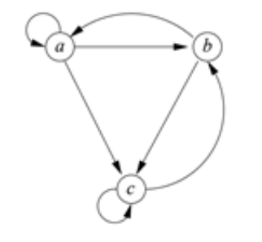

## 链接分析

1.选择题：下面说法正确的是（）
C

- A 如果转移矩阵分割成$k\times k$块，系数矩阵存储方式不需要改变
- B PageRank 的计算一般不采用迭代的方法
- C 分块计算PageRank的方式会增加v的读取次数
- D PageRank计算不要考虑不再MapReduce框架之外的方式

2.选择题：下列说法错误的是()
B

- A 转移矩阵每一列的和为1
- B 面向主题的PageRank不需要了解用户任何信息
- C 网页有两种属性：重要性和导航性
- D PageRank值的大小衡量了网页的重要性

3.选择题：下面说法正确的是（）
C

- A Google 的算法可以完全杜绝网页搜索作弊者
- B PageRank是Google搜索引擎的唯一算法
- C 经过足够多次网页冲浪，停留概率大的网页的重要性较高
- D 垃圾农场中的可达网页是作弊者完全控制的网页

4.判断题：删除终止点得到的PageRank的值任然可以被认为是随机冲浪者的概率分布
x

5.计算题：写出下图对应的转移矩阵，并计算初始概率分布向量为[1/3,1/3,1/3]时下一步的概率分布向量

## 频繁项集

判断题：频繁项集不可以用于生物标志物关联（）
错

选择题：下列哪个指标衡量关联规则的“有可能”程度（）
C

- A 支持度
- B 兴趣度
- C 可信度
- D 错误率

判断题：在购物篮模型中，购物篮的数量应远大于购物篮中项的数量
对

判断题：频繁项集不可以用于生物标志物关联（）

计算题：针对以下购物篮数据，假设支持度阈值为3
请按照**A-priori法**，计算该数据的二元素频繁项集。

|Transactions|Items|
|---|---|
|1|Bread, Jelly,Peanut,Butter|
|2|Bread,Buffer|
|3|Bread,Jelly|
|4|Bread,Milk,Butter|
|5|Chips,Milk|
|6|Bread,Chips|
|7|Bread,Milk|
|8|Chips,Jelly|