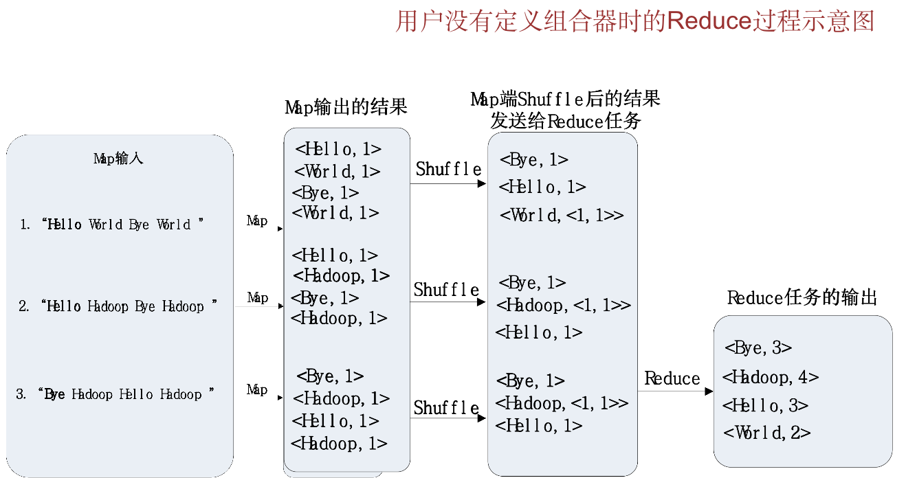
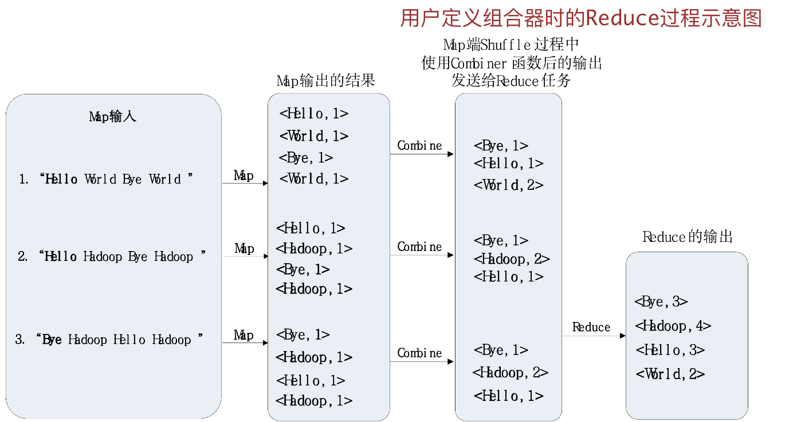

# 概览

<!-- 第一周 -->

## 课程简介

- 本课程主要关注极大规模的挖掘（data min-ing），极大规模是这些数据无法在内存中存放。
- 本课程主重点强调数据规模（极大），很多例子都是来自于 web 本身. （数据量很大）
- 本课程从算法角度来看待数据挖掘，即数据挖掘是将算法应用于数据，而不是使用数据来“训练”某种机器学习引擎.
- 本课程侧重于 web+数据挖掘+分布式处理

### 课程主要内容

- Web 数据挖掘的基本概念
- Map-Reduce 及其协议栈
- 相似项发现（哈希关键技术）
- 数据流挖掘
- 搜索引擎技术
- 频繁项集挖掘
- 大规模高维数据集的聚类

## 主要内容

## 1 数据挖掘基本概念

**数据挖掘**是**数据”模型“（model）的发现**的过程。模型，能够实现的，生成的。用数学语言描述的一类模型。
数学模型可以是一个或一组代数方程、微分方程、差分方程、积分方程或统计学方程，也可以是它们的某种适当的组合

从数据中抽取知识需要：存储，管理和**分析**。数据挖掘 ≈ 大数据 ≈ 预测分析 ≈ 数据科学。

### 1.1 数据挖掘基本概念

#### 统计建模

统计学习理论是一种研究训练样本有限情况下的机器学习规律的学科。
**统计建模**是以*计算机统计分析软件*为工具，利用各种*统计分析方法*对批量数据建立统计模型和探索处理的过程

#### 机器学习 vs 数据挖掘

异中求同 同中求异（目标不同，算法相同）

机器学习是一门多学科交叉专业，涵盖概率论知识，统计学知识，近似理论知识和复杂算法知识，使用计算机作为工具并致力于真实实时的模拟人类学习方式， 并将现有内容进行知识结构划分来有效提高学习效率。
机器学习三要素： 模型，策略，算法。

数据挖掘技术是机器学习算法和数据存取技术的结合，利用机器学习提供的统计分析、知识发现等手段分析海量数据，同时利用数据存取机制实现数据的高效读写。

#### 建模的计算方法 Computational Approaches to Modeling

##### 数据汇总 Summarization

1. PageRank, chap. 5：**网页排名**，又称网页级别、Google 左侧排名或佩奇排名，是一种由根据网页之间相互的超链接计算的技术，而作为网页排名的要素之一
2. cluster, chap. 7：将物理或抽象对象的集合分成由类似的对象组成的多个类的过程被称为**聚类**。聚类分析又称群分析，它是研究（样品或指标）分类问题的一种统计分析方法。聚类分析起源于分类学，但是聚类不等于分类。聚类与分类的不同在于，聚类所要求划分的类是未知的。如：伦敦霍乱

##### 特征抽取 Feature Extraction

###### 频繁项集, chap. 6

- 项集：最基本的模式是项集，它是指若干个项的集合。
- 频繁模式是指数据集中频繁出现的项集、序列或子结构。
- 频繁项集是指支持度大于等于最小支持度(min_sup)的集合。其中支持度是指某个集合在所有事务中出现的频率。频繁项集的经典应用是购物篮模型。

###### 相似项 Similar item, chap. 3

**协同过滤** Collaborative filtering
例如：基于用户的协同过滤算法是通过用户的历史行为数据发现用户对商品或内容的喜欢(如商品购买，收藏，内容评论或分享)，并对这些喜好进行度量和打分。

### 1.2 数据挖掘的统计限制

#### 没有免费午餐定理

**没有免费午餐定理**(No Free Lunch，简称 NFL)是 wolpert 和 Macerday 提出的“最优化理论的发展”之一：在机器学习算法中的体现为**在没有实际背景下，没有一种算法比随机胡猜的效果好**

1. 欠拟合 High bias(uderfit)：拟合偏差比较大，（没有学到所有共有特征，树->树叶）
2. "just right"
3. 过拟合 High variance：拟合偏差小，但是结果不符合认知，在新的测试样本情况下，很大可能不会落在拟合曲线上，（将样本独有特征学了，树叶无锯齿->非树叶）

#### 整体情报预警

这是引出邦弗朗尼原理的例子

#### 邦弗朗尼原理

数据挖掘所谓发现的模型可能是没有任何意义的，统计上称为**邦弗朗尼原理** 。

<!-- 第二周 -->

### 相关知识

#### 词语在文档中的重要性

TF.IDF 词项频率乘以逆文档频率 Term Frequency times Inverse Document Frequency：用于度量词语重要性

- 哈希函数 Hash function: hash-key->bucket number. 通常会使用$h(x) = x\  mod \ B$通常使用质数作为 B，使得分配近似均匀分布
- 索引 index
- 二级存储器 secondary Storage: 容量大，断电不易失去，读取速度慢（相对于 RAM 内存）
- e 和幂定理 The base of Natural Logarithms and Power Law

<!-- ## 第三周-分布式文件系统 -->

## 2 MapReduce 及新协议栈

### 2.1 分布式文件系统

1. 海量(enormous)冷(rarely updated)数据如何存储？使用**分布式文件系统**存储
   1. 硬盘够不够大：分布式存储
   2. 硬盘够不够安全：冗余机制
2. 分布式文件系统的特点
   1. 使用普通廉价的硬件，**硬件故障是常态**而不是异常
   2. 流式数据访问：数据批量读取而非随机读写，擅长做**数据分析**而不是数据处理
   3. 大规模数据集
   4. 简单一致性模型，一次性写多次读，一旦写入不能修改。**现在只允许追加操作**
   5. 文件是**文件块**，而不是文件整体存放
3. 分布式文件系统的组成
   1. Name Node and Secondary Name Node: edit logs and fsimage
   2. Data Node
4. 大量的数据如何计算？
   1. MapReduce

<!-- ## 第四周-MapReduce 框架 -->

### 2.2 MapReduce 框架

1. 不同的 Map 任务和 Reduce 任务之间不会进行通信
2. 用户不能显式地进行机器之间的信息交换，所有通信依赖 MapReduce 框架
3. MapReduce 不适用于**实时**的计算，如计算当前某产品的抢购数量
4. MapReduce 采用“分而治之”策略，一个存储在分布式文件系统中的大规模数据集，会被切分成许多独立的分片（split），这些分片可以被多个 Map 任务并行处理
   MapReduce 设计的一个理念就是“计算向数据靠拢”，而不是“数据向计算靠拢”，因为，移动数据需要大量的网络传输开销
5. Reduce 任务需要远远小于 Map 的数目，同时应当多于 Reducer 的数目
6. 用于搜索领域，解决海量数据的计算问题
7. MapReduce 将复杂的、运行于大规模集群上的并行计算过程高度地抽象到了两个函数：Map 和 Reduce
8. 编程容易，不需要掌握分布式并行编程细节，也可以很容易把自己的程序运行在分布式系统上，完成海量数据的计算
9. MapReduce 框架采用了 Master/Worker 架构，包括一个 Master 和若干个 Worker。
10. Hadoop 框架是用 Java 实现的，但是，MapReduce 应用程序则不一定要用 Java 来写

## 第五周-MapReduce 应用

1. 字数统计
2. 关系代数计算
3. 基于 MapReduce 的矩阵-向量乘法
4. 基于 MapReduce 的矩阵-矩阵乘法

## 第六周-近邻搜索的应用

## 7

## 8 Web 广告

主要场景

- 广告信息平台（直投）
- 媒体网站广告（显示）
- Adwords 广告

三个算法

离线算法( off line algorithms)，是指基于在执行算法前输入数据已知的基本假设，也就是说，对于一个离线算法，在开始时就需要知道问题的所有输入数据，而且在解决一个问题后就要立即输出结果。

在线算法是指它可以以序列化的方式一个个的处理输入，也就是说在开始时并不需要已经知道所有的输入。
执行算法时，不知道所有的输入

贪心算法，又称贪婪算法，是一种在每一步选择中都采取在当前状态下最好或最优（即最有利）的选择，从而希望导致结果是最好或最优的算法。比如在旅行推销员问题中，如果旅行员每次都选择最近的城市，那这就是一种贪心算法。

竞争率

定义竞争率（competitive ratio）：存在某个小于 1 的常数 c，使得对于任一输入，一个具体的在线算法的结果至少是最优离线算法结果的 c 倍。

## 9 推荐系统

### 推荐系统和搜索引擎的异同点

相同点：
都是一种帮助用户快速发现有用信息的工具
不同点：
搜索引擎需要用户主动提供准确的关键词来寻找信息
推荐系统不需要用户提供明确的需求，而是通过分析用户的历史行为给用户的兴趣建模
从某种意义上说，推荐系统和搜索引擎对于用户来说是两个互补的工具
搜索引擎满足了用户有明确目的时的主动查找需求
推荐系统能够在用户没有明确目的的时候帮助他们发现感兴趣的新内容

### 推荐系统可以分成两大类

基于内容的系统(Content-based System)：这类系统主要考察的是推荐项的性质。项之间的相似度通过计算它们的属性之间的相似度来确定。例如，如果一个 Netflix 的用户观看了多部西部牛仔片，那么系统就会将数据库中属于“西部牛仔”类的电影推荐给该用户。
协同过滤系统(Collaborative Filtering System)：这类系统通过计算用户或/和项之间的相似度来推荐项。与某用户相似的用户所喜欢的项会推荐给该用户。
