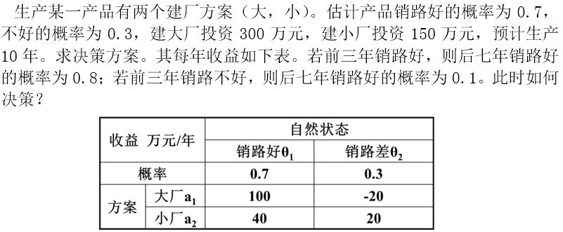

# 单元测验答案

## 第一章

1. (        )有“万园之园”的美称，被法国作家维克多·雨果称誉为“理想与艺术的典范”。
   1. 圆明园
2. 我国历史上，（     ）是最长寿、最具有“可持续发展”能力、最符合科学发展观的水利工程。
   1. 都江堰
3. 工程的特点有（    ）
   1. 服务于某个特定目的的
   2. 各项技术工作的总和
   3. 利用资源为人类服务
4. 青藏公路攻克了（）三大世界性工程难题
   1. 多年冻土
   2. 高寒缺氧
   3. 生态脆弱

## 第二章

1. 根据《普通高等学校本科专业目录和专业介绍》，我国工学一级学科类别包含（   ）个门类。
   1. 31
2. 房地产产业属于国民经济第三产业大类（ ）
   1. 对
3. 按照自然属性，我国国家标准将建设工程分为（ ）三大类
   1. 土木工程
   2. 建筑工程
   3. 机电工程
4. 现代工程技术系统需要进行（ ）方面的协调
   1. 功能
   2. 工程设计质量
   3. 工程面之间以及工程系统界面之间
   4. 工程与周边环境

## 第三章

1. 下列哪些因素可能导致工程的服务寿命小于设计寿命
   1. 遭受自然灾害
   2. 产品竞争力下降
   3. 维修费用逐年增加
2. 在工程全寿命期中，花费时间最长，并实现工程使用价值的是哪个阶段
   - [ ] 前期策划阶段
   - [ ] 设计和计划阶段
   - [ ] 施工阶段
   - [x] 运行阶段
3. 工程与环境之间存在着交互作用，它们相互影响，相互制约，这里所说的环境包括
   - [x] 自然环境
   - [x] 社会环境
   - [x] 经济环境
   - [ ] 仅包含自然环境
4. 在工程全寿命期各阶段中，资金投入最少，但对工程的运行状况和使用寿命影响最大的是
   - [x] 前期策划阶段
   - [ ] 设计和计划阶段
   - [ ] 施工阶段
   - [ ] 运行阶段
5. 某城市经过调研发现，城市道路交通非常拥堵，急需发展城市轨道交通建设工程，这一工程构思起源于
   - [ ] 获得经济效益
   - [x] 上层系统运行遇到困难
   - [ ] 优化产业结构
   - [ ] 扩大生产能力
6. 我们知道，并非所有的工程构思都能变成实体工程，对工程构思的选择原则包括
   - [x] 有良好的市场需求前景
   - [x] 有进行项目建设的能力
   - [ ] 有助于提升领导的政绩
   - [x] 对环境不造成破坏
7. 下列哪一项工作是在工程运行阶段完成的
   - [ ] 工程竣工验收
   - [x] 对工程进行扩建
   - [ ] 对工程的立项做出决策
   - [ ] 筹建工程建设管理组织

## 第三章

1多选(2分)
下列哪些因素可能导致工程的服务寿命小于设计寿命

得分/总分

A.
遭受自然灾害                          

0.67/2.00

B.
产品竞争力下降

0.67/2.00

C.
工程建设过程中使用优质合格的材料

D.
维修费用逐年增加

0.67/2.00
正确答案：A、B、D你选对了
2单选(1分)
‌在工程全寿命期中，花费时间最长，并实现工程使用价值的是哪个阶段

‎
得分/总分

A.
前期策划阶段

B.
设计和计划阶段

C.
施工阶段

D.
运行阶段

1.00/1.00
正确答案：D你选对了
3多选(2分)
工程与环境之间存在着交互作用，它们相互影响，相互制约，这里所说的环境包括

‍
得分/总分

A.
自然环境

0.67/2.00

B.
社会环境

0.67/2.00

C.
经济环境

0.67/2.00

D.
仅包含自然环境

正确答案：A、B、C你选对了
4单选(1分)
在工程全寿命期各阶段中，资金投入最少，但对工程的运行状况和使用寿命影响最大的是

‏
得分/总分

A.
前期策划阶段

1.00/1.00

B.
设计和计划阶段

C.
施工阶段

D.
运行阶段

正确答案：A你选对了
5单选(1分)
某城市经过调研发现，城市道路交通非常拥堵，急需发展城市轨道交通建设工程，这一工程构思起源于

得分/总分

A.
获得经济效益

B.
上层系统运行遇到困难

1.00/1.00

C.
优化产业结构

D.
扩大生产能力

正确答案：B你选对了
6多选(2分)
我们知道，并非所有的工程构思都能变成实体工程，对工程构思的选择原则包括

‍
得分/总分

A.
有良好的市场需求前景

0.67/2.00

B.
有进行项目建设的能力

0.67/2.00

C.
有助于提升领导的政绩

D.
对环境不造成破坏

0.67/2.00
正确答案：A、B、D你选对了
7单选(1分)
下列哪一项工作是在工程运行阶段完成的

得分/总分

A.
工程竣工验收

B.
对工程进行扩建

1.00/1.00

C.
对工程的立项做出决策

D.
筹建工程建设管理组织

正确答案：B你选对了

## 第四章

1

多选(2分)

现代工程规模较大，消耗自然资源和社会资源较多，对社会影响较大，因此必然承担重大的责任。工程的使命主要体现在

得分/总分

- A.

  提供符合要求的产品或服务

  0.67/2.00

- B.

  承担社会责任

  0.67/2.00

- C.

   承担历史责任

  0.67/2.00

- D.

  单纯追求经济效益

  

正确答案：A、B、C你选对了

2

单选(1分)

在工程的准则中，处理当代与后代关系的原则是

‏

得分/总分

- A.

  促进和谐

  

- B.

  天人合一

  

- C.

  以人为本

  

- D.

  可持续发展

  1.00/1.00

正确答案：D你选对了

3

单选(1分)

下列描述中，哪一项体现了工程与自然的“天人合一”准则

‎

得分/总分

- A.

   在工程建设和运行中，对产生的废物进行减量化、无害化处理

  1.00/1.00

- B.

  在工程建设和运行中，尽可能节约使用自然资源

  

- C.

  在工程建设和运行中，饱和操作人员的健康和安全

  

- D.

  在工程中，添加为老人、儿童、残障人士设计的特殊设施

  

正确答案：A你选对了

4

多选(2分)

现代工程的特点决定了工程的总目标是多维的，除了达到预定的功能和取得良好的经济效益，工程总目标还包括

‏

得分/总分

- A.

  符合预定的时间要求

  0.50/2.00

- B.

  让各工程相关者满意

  0.50/2.00

- C.

  与环境相协调

  0.50/2.00

- D.

  具有可持续发展能力

  0.50/2.00

正确答案：A、B、C、D你选对了

5

单选(1分)

工程价值观的内容，不包括

‍

得分/总分

- A.

  工程发展观

  

- B.

  工程文化观

  

- C.

  工程自然观

  

- D.

  工程社会观

  1.00/1.00

正确答案：D你选对了

6

多选(2分)

科学的工程自然观是要正确认知工程与自然生态环境的关系，具体包括

得分/总分

- A.

  敬畏自然，追求工程与自然的和谐

  0.67/2.00

- B.

  工程建设应因地制宜，追求生态平衡

  0.67/2.00

- C.

  尽可能使工程资源循环利用

  0.67/2.00

- D.

  为节约成本，大力压缩设计和施工时间

  

正确答案：A、B、C你选对了

7

单选(1分)

长城是著名的世界文化遗产，虽然早已失去了军事防御的作用，但却不断地向世界展示着中华民族的智慧和创造能力，在人类历史上留下的宝贵遗产，这一特点体现了

‌

得分/总分

- A.

  工程基本价值观

  

- B.

  工程文化观

  1.00/1.00

- C.

  工程自然观

  

- D.

  工程发展观

  

正确答案：B你选对了

## 第五章

1

单选(1分)

我国古代大型工程，通常是朝廷、官府派官员筹划、监工，负责全部管理事务，这种管理模式为

‏

得分/总分

- A.

  集权管理

  1.00/1.00

- B.

  专业化分工管理

  

- C.

  统筹法管理

  

- D.

  承发包模式管理

  

正确答案：A你选对了

2

单选(1分)

我国近代第一个工部局于1854年成立于

‍

得分/总分

- A.

  广州

  

- B.

  厦门

  

- C.

  天津

  

- D.

  上海

  1.00/1.00

正确答案：D你选对了

3

单选(1分)

在工程建设中，工程承包企业最早出现在

得分/总分

- A.

  古代

  

- B.

  近代

  1.00/1.00

- C.

  现代

  

- D.

  以上答案都不对

  

正确答案：B你选对了

4

多选(2分)

下列哪些体现了现代工程管理方法的科学化

‎

得分/总分

- A.

  将系统论、控制论运用到工程管理中

  0.67/2.00

- B.

  运用数理统计方法解决工程管理中的问题

  0.67/2.00

- C.

  现代信息技术的使用

  0.67/2.00

- D.

  注重工程管理人才的培养

  

正确答案：A、B、C你选对了

5

单选(1分)

从时间跨度上来看，工程管理

得分/总分

- A.

  是对工程全寿命期的管理

  1.00/1.00

- B.

   仅对工程前期策划进行管理

  

- C.

  仅对工程设计和计划阶段进行管理  

  

- D.

  仅对工程建设阶段进行管理

  

正确答案：A你选对了

6

单选(1分)

在工程活动过程中，投资者对工程进行管理的最主要目的是

‎

得分/总分

- A.

  完成工程建设  

  

- B.

  获得预期投资回报

  1.00/1.00

- C.

  维护社会公共利益 

  

- D.

   保证工程设备安全运行

  

正确答案：B你选对了

7

单选(1分)

工程活动中负责行政管理，对工程活动进行监督工作的工程相关者是

‌

得分/总分

- A.

  业主

  

- B.

  承包商

  

- C.

  项目管理公司

  

- D.

  政府

  1.00/1.00

正确答案：D你选对了

## 第六章

1

单选(1分)

‌以下关于资本金的说法中，错误的是：

‏

得分/总分

- A.

  资本金是投资者能够用于工程建设的款项。

  

- B.

  资本金属于非债务资金。

  

- C.

  资本金反映了工程的投资（股本）结构。

  

- D.

  资本金是工程建设的主要资金来源。

  1.00/1.00

正确答案：D你选对了

2

多选(2分)

‍以下各项中，属于负债来源的是

‏

得分/总分

- A.

  贷款

  0.67/2.00

- B.

  存款

  

- C.

  发行债券

  0.67/2.00

- D.

  资产证券化

  0.67/2.00

正确答案：A、C、D你选对了

3

单选(1分)

‎以下对于BOT方式的描述错误的是

‌

得分/总分

- A.

  项目公司有建设权但无经营权。

  1.00/1.00

- B.

  BOT是指“建造-运营-转让”。

  

- C.

  BOT是PPP方式的一种。

  

- D.

  一般由政府所属的公司出面发起项目。

  

正确答案：A你选对了

4

多选(2分)

‍以下属于我国轨道交通工程常用的PPP融资模式的是：

‏

得分/总分

- A.

  政府全额投资模式

  

- B.

  BOT模式

  1.00/2.00

- C.

  私人投资模式

  

- D.

  股权投资模式

  1.00/2.00

正确答案：B、D你选对了

5

多选(2分)

‏以下对分阶段分专业平行委托方式的特点描述正确的是

‎

得分/总分

- A.

  虽然工程责任的落实比较困难，但各方职责明确。

  

- B.

  业主可以有节奏地进行工程的实施，但通常工期较长。

  1.00/2.00

- C.

  难以调动各方的积极性和创造性，特别是设计单位和施工承包商。

  1.00/2.00

- D.

  工程的分标很细，提高了管理工作的效率。

  

正确答案：B、C你选对了

6

单选(1分)

‎以下对于EPC总承包方式的描述错误的是

‎

得分/总分

- A.

  业主的工程管理任务少，责任和风险较小。

  

- B.

  有效地减少了合同纠纷和索赔，保证工程总目标的实现。

  

- C.

  能够最大限度发挥承包商方案优化的积极性和创造性。

  

- D.

  一般采用总价合同，承包商的报价依据比较充足。

  1.00/1.00

正确答案：D你选对了

7

单选(1分)

‎以下对工程的管理方式中，社会化程度最高的是：

‌

得分/总分

- A.

  业主自己管理

  

- B.

  聘请各类咨询公司辅助工程管理

  

- C.

  委托项目管理模式

  

- D.

  代建制

  1.00/1.00

正确答案：D你选对了

8

多选(2分)

‎工程运行阶段仍然需要工程管理的原因主要包括以下哪几项？

‎

得分/总分

- A.

  通过运行阶段的管理，可以发现工程质量不合格等问题，从而消除安全隐患。

  

- B.

  由于系统的复杂性，工程运行过程中有可能产生故障，影响用户使用。

  0.67/2.00

- C.

  对工程进行运行维护，有利于维持其正常和健康的状态，降低运行维护费用。

  0.67/2.00

- D.

  通过运行维护可对新工程的规划、设计和施工提供经验和教训，提升工程建设水平。

  0.67/2.00

正确答案：B、C、D你选对了

## 第七章

1

单选(1分)

‏对于工程的战略问题，以下论述中不正确的是：

‎

得分/总分

- A.

  前期的战略选择对工程的影响是最大的。

  

- B.

  战略选择是在工程建设过程中逐步确定的。

  1.00/1.00

- C.

  工程战略的选择需要考虑市场、环境、技术、资金等多方面的因素。

  

- D.

  工程价值体系是十分复杂和充满矛盾的，导致了战略本身的矛盾性。

  

正确答案：B你选对了

2

多选(2分)

‍工程建设阶段的主要战略问题包括：

‎

得分/总分

- A.

  工程实施方式的决策

  0.67/2.00

- B.

  工程系统规划中的重大问题决策

  

- C.

  重大工程主要施工技术方案

  0.67/2.00

- D.

  实施过程的战略控制

  0.67/2.00

正确答案：A、C、D你选对了

3

多选(2分)

‌工程的经济问题是由哪些方面引导出来的？

得分/总分

- A.

  经济政策

  

- B.

  经济作用

  1.00/2.00

- C.

  经济目标

  1.00/2.00

- D.

  经济措施

  

正确答案：B、C你选对了

4

单选(1分)

工程的经济性问题所涉及的四个方面不包括下列哪一项？

得分/总分

- A.

  工程建设成本的确定

  

- B.

  工程建成后的运行和维护费用

  

- C.

  工程的投资收益问题

  

- D.

  工程项目的合理性

  1.00/1.00

正确答案：D你选对了

5

单选(1分)

‏对于工程组织，以下说法错误的是：

‌

得分/总分

- A.

  现代工程规模庞大，任何工程都有一个非常复杂的组织系统。

  

- B.

  在工程全寿命期过程中，工程建设组织是最复杂的。

  

- C.

  工程组织所具备的长期性和稳定性，使其能有效化解工程中的争执和矛盾。

  1.00/1.00

- D.

  现代工程组织成员多，只有建立严密而有效的组织，才能使他们在工程中高效地工作。

  

正确答案：C你选对了

6

多选(2分)

从目标因素管理的角度，工程管理的内容包括哪几项？ 

得分/总分

- A.

  各部门及人员的管理。

  

- B.

  三大目标（质量、进度、成本）的管理。

  0.67/2.00

- C.

  HSE（健康-安全-环境）管理。

  0.67/2.00

- D.

  利益相关者管理。

  0.67/2.00

正确答案：B、C、D你选对了

7

单选(1分)

‌对于工程的法律问题，以下说法错误的是：

‍

得分/总分

- A.

  由于工程的复杂性和特殊性，与工程建设和运行相关的法律法规数量非常多。

  

- B.

  工程在其全寿命期内可能碰到各种各样的法律法规问题。

  

- C.

  工程建设不能与法律法规相冲突，否则就会承担相应的法律后果。

  

- D.

  从成本角度考虑，已建设完成的工程即使不符合城市规划要求，一般也不会做出修改。

  1.00/1.00

正确答案：D你选对了

8

多选(2分)

‌对工程合同的重要作用，以下描述正确的是：

得分/总分

- A.

  合同是工程组织的纽带，可以协调工程各方的行为。

  0.67/2.00

- B.

  业主通过合同运作工程项目，并实施对工程过程的控制。

  0.67/2.00

- C.

  合同具有法律效力，一旦签订即不可更改，也是解决争执的唯一依据。

  

- D.

  合同是工程参加者各方的行为准则和依据，也是工程组织的运作规则。

  0.67/2.00

正确答案：A、B、D你选对了

## 第八章

1

单选(1分)

在施工中设置监理，现场检查，防止偷工减料等都属于（ ）

‌

得分/总分

- A.

  事前控制

  

   

  

  

- B.

   事中控制

  

   

   

  

  1.00/1.00

- C.

   事后控制

   

  

  

- D.

  被动控制

  

正确答案：B你选对了

2

多选(2分)

‎PDCA循环法包括（ ）

得分/总分

- A.

  计划

  

  

  0.50/2.00

- B.

   执行

  

  0.50/2.00

- C.

  检查

  

  

  0.50/2.00

- D.

   处理

  

  0.50/2.00

正确答案：A、B、C、D你选对了

3

单选(1分)

（ ）已成为衡量工程相关产业现代化程度的标志。

‍

得分/总分

- A.

   现代工程信息化水平的高低

  

  

  1.00/1.00

- B.

   现代工程组织管理水平的高低

  

  

  

  

- C.

   现代工程机械化程度的高低

  

  

  

- D.

   现代工程集成化程度的高低

  

正确答案：A你选对了

4

单选(1分)

项目管理知识体系PMBOK的概念首先由美国的项目管理协会（PMI）提出。PMBOK 将项目划分为（）个过程，将项目管理分为（）大知识体系。

‏

‌

‏

得分/总分

- A.

   五，九

  

  

  

  

- B.

  五，十

  

  

  1.00/1.00

- C.

   四，九

  

  

  

  

- D.

   四，十

  

  

  

正确答案：B你选对了

5

单选(1分)

某人第一年年初存入银行10万元，年利率为6%，存5年，按复利计算，5年后连本带利可得（ ）万元：

‏

‏

得分/总分

- A.

   12.62

  

   

  

  

- B.

  12.84

  

  

  

- C.

  13

  

  

  

- D.

  13.38

   

  

  1.00/1.00

正确答案：D你选对了

6

单选(1分)

根据边际分析法，如果在一定基础上再增加的投入量（ ）所得到的利益增加，则是最优的，或者说资源能够得到最佳利用。

‏

‏

‏

得分/总分

- A.

   大于

  

  

  

- B.

   等于

  

  

  1.00/1.00

- C.

   小于

  

  

- D.

  空

  

正确答案：B你选对了

7

单选(1分)

（ ）是法律和工程的结合，已经成为现代工程管理中难度最大、综合性最强的管理职能，也是工程管理中最富特色的地方。。

‍

‍

得分/总分

- A.

   工程合同管理

  

  1.00/1.00

- B.

   工程安全管理

  

  

- C.

   工程信息管理

  

  

  

- D.

  工程人员管理

  

  

正确答案：A你选对了

## 第九章

1

多选(2分)

‍职业资格包括（ ）

‏

‍

‏

得分/总分

- A.

   从业资格

  

  

  

  1.00/2.00

- B.

   上岗资格

  

  

  

  

- C.

   执业资格

  

  

  

  1.00/2.00

- D.

   工作资格

  

  

  

正确答案：A、C你选对了

2

单选(1分)

‎（ ）可以从事建设工程项目总承包或施工管理。

‌

‎

‌

‎

‌

得分/总分

- A.

   注册建筑师

  

  

  

- B.

   注册建造师

  

   

  

  1.00/1.00

- C.

   注册监理工程师

  

   

  

  

- D.

   注册造价工程师

   

  

  

正确答案：B你选对了

3

单选(1分)

‎国际项目经理资质格认证IPMP分为（ ）个等级

‌

‎

‌

‎

‌

得分/总分

- A.

  二

  

- B.

  三

  

- C.

  四

  1.00/1.00

- D.

  五

  

正确答案：C你选对了

4

多选(2分)

（）会员，被称为英国“皇家特许建造师”。

‏

‏

‏

得分/总分

- A.

   资深会员

  

   

  

  1.00/2.00

- B.

   正式会员

  

  

  1.00/2.00

- C.

   准会员

  

   

  

  

- D.

   助理会员

   

  

  

正确答案：A、B你选对了

## 第十章

1

多选(2分)

按环境条件分类，决策可以分为（  ）

‏

得分/总分

- A.

  程序化决策

  

  

- B.

  确定型决策

  0.67/2.00

- C.

  风险型决策

  0.67/2.00

- D.

  不确定型决策

  0.67/2.00

正确答案：B、C、D你选对了

2

多选(2分)

‏按所采用的方式和方法，决策可以分为（  ）

‌

得分/总分

- A.

  经验决策

  1.00/2.00

- B.

  程序化决策

  

- C.

  非程序化决策

  

- D.

  科学决策

  1.00/2.00

正确答案：A、D你选对了

3

判断(1分)

‏一个方案也可以进行决策

得分/总分

- A.

  

  

- B.

  

  1.00/1.00

正确答案：B你选对了

**解析：**决策必须至少有两个或两个以上方案

4

判断(1分)

具有多种自然状态，且每个状态的概率未知时，为风险型决策。

‌

得分/总分

- A.

  

  1.00/1.00

- B.

  

  

正确答案：A你选对了

**解析：**具有多种自然状态，且每个状态的概率未知时，为不确定型决策。

5

判断(1分)

集体决策可提高决策的科学性，提高决策的效率，少出或不出纰漏。

‏

得分/总分

- A.

  

  

- B.

  

  1.00/1.00

正确答案：B你选对了

**解析：**集体决策往往效率较低。

## 第十一章

1

单选(1分)

‎在下列经济决策指标中，没有考虑时间价值因素的指标是（   ）

‏

‎

‏

得分/总分

- A.

  内含报酬率

  

- B.

  净现值

  

- C.

  现值指数

  

- D.

  回收期

  1.00/1.00

正确答案：D你选对了

2

单选(1分)

当净现金流量和项目寿命期一致时，折现率上升会导致净现值（  ）

‎

得分/总分

- A.

  不变

  

- B.

  无法判断

  

- C.

  上升 

  

- D.

  下降 

  1.00/1.00

正确答案：D你选对了

**解析：**  B、折现率上升将导致净现值下降。

3

单选(1分)

‎利率：10%。A方案第0年投资100万元，项目寿命期为5年，每年的净现金流量为40万元。B方案第0年投资120万元，项目寿命期为5年，每年净现金流量为45万元。试用净现值法比较A和B方案的优劣。（    ）

‏

得分/总分

- A.

  A和B相同

  

- B.

  B优于A

  

- C.

  A优于B

  1.00/1.00

- D.

  无法比较

  

正确答案：C你选对了

4

单选(1分)

‏盈亏平衡点指标可以反映项目风险的大小，盈亏平衡产量越高，项目风险（  ）。

‍

得分/总分

- A.

  越小

  

- B.

  不变

  

- C.

  无法判断

  

- D.

  越大

  1.00/1.00

正确答案：D你选对了

5

单选(1分)

选购打印机，预计打印2万张，激光打印机投资为2000元，耗材为0.02元/张；喷墨打印机投资为750元，耗材为0.10元/张。应购激光还是喷墨打印机？（   ）

‍

得分/总分

- A.

  喷墨打印机

  

- B.

  都可以

  

- C.

  激光打印机

  1.00/1.00

- D.

  无法判断

  

正确答案：C你选对了

6

单选(1分)

‍有A、B、C三个方案。A方案年固定成本为800万元，单位变动成本为10元。B方案年固定成本为500万元，单位变动成本为20元。C方案年固定成本为300万元，单位变动成本为30元。试判断年产量为23万件时，应选择哪一方案。（   ）

‎

得分/总分

- A.

  B方案

  1.00/1.00

- B.

  A、B、C中任一方案

  

- C.

  A方案

  

- D.

  C方案

  

正确答案：A你选对了

7

单选(1分)

‎

‏

得分/总分

- A.

  A产品1.5，B产品3.5

  

- B.

  A产品3.5，B产品1.5

  1.00/1.00

- C.

  A产品3.5，B产品2.0

  

- D.

  A产品2.5，B产品2.5

  

  

  

正确答案：B你选对了

8

单选(1分)

‍

‎

得分/总分

- A.

  A产品25.4，B产品12.3

  

  

- B.

  A产品15，B产品25

  

  

- C.

  A产品12.3，B产品25.4

  

  1.00/1.00

- D.

  A产品25，B产品15

  

正确答案：C你选对了

9

单选(1分)

‍

‎

得分/总分

- A.

  任一方案

  

  

- B.

  方案2

  

- C.

  方案1

  1.00/1.00

- D.

  方案3

  

  

正确答案：C你选对了

10

单选(1分)

‏

得分/总分

- A.

  方案D1

  1.00/1.00

- B.

  方案D2

  

- C.

  任一方案

  

- D.

  方案D3

  

正确答案：A你选对了

11

单选(1分)

‎

‍

得分/总分

- A.

  90

  

- B.

  70

  1.00/1.00

- C.

  80 

  

- D.

  60

  

正确答案：B你选对了

**解析：**  B、60*0.4+70*0.3+80*0.2+90*0.1=70

12

单选(1分)

‍

‎

得分/总分

- A.

  不建

  

- B.

  建大厂

  1.00/1.00

- C.

  建大厂或小厂都可以

  

- D.

  建小厂

  

正确答案：B你选对了

**解析：**  B、注意分成前面3年和后面7年分别进行计算。

13

单选(1分)

‍

‍

得分/总分

- A.

  不调查

  1.00/1.00

- B.

  调查	

  

- C.

  畅销时应进行调查

  

- D.

  无法确定

  

正确答案：A你选对了

14

多选(2分)

不确定型决策的主要方法有（   ）。

‏

得分/总分

- A.

  保守法 

  0.50/2.00

- B.

  冒险法  

  0.50/2.00

- C.

  乐观系数法 

  0.50/2.00

- D.

  等可能性法

  0.50/2.00

正确答案：A、B、C、D你选对了

15

判断(1分)

净现值法只能用于多方案的必选。（   ）

‍

得分/总分

- A.

  

  

- B.

  

  1.00/1.00

正确答案：B你选对了

**解析：**可以单方案，也可以多方案

16

判断(1分)

净现值法可以对寿命期不同的方案进行直接比较。（   ）

‏

得分/总分

- A.

  

  

- B.

  

  1.00/1.00

正确答案：B你选对了

**解析：**净现值法不可以用于不同寿命期方案之间的必选。

17

判断(1分)

‎不确定型决策是指决策者无法确定未来各种自然状态发生的概率的决策。（  ）

‍

得分/总分

- A.

  

  

- B.

  

  1.00/1.00

正确答案：B你选对了

18

判断(1分)

保守法指决策者不知道各种自然状态中任一种发生的概率，为避免最坏的结果，力求风险最小，首先确定每一可选方案在不同自然状态下的最小收益值，然后从最小收益值中，选出最小值。（  ）

‌

得分/总分

- A.

  

  1.00/1.00

- B.

  

  

正确答案：A你选对了

**解析：**从最小收益中选最大值。

19

判断(1分)

‏风险型决策是决策者对未来状况无法做出肯定的判断，但每种自然状态发生的概率是可估计的决策（  ）。

‍

得分/总分

- A.

  

  

- B.

  

  1.00/1.00

正确答案：B你选对了

20

判断(1分)

‎绘制决策树时，应从左到右逐步进行。计算期望值时，应从右到左进行（   ）。

‏

得分/总分

- A.

  

  1.00/1.00

- B.

  

  

正确答案：A你选对了

21

判断(1分)

‏获取情报可以对自然状态发生概率的估计更急准确，因此，企业进行情报获取是必需的。（    ）

‎

得分/总分

- A.

  

  

- B.

  

  1.00/1.00

正确答案：B你选对了

**解析：**情报的成本要小于情报的价值。