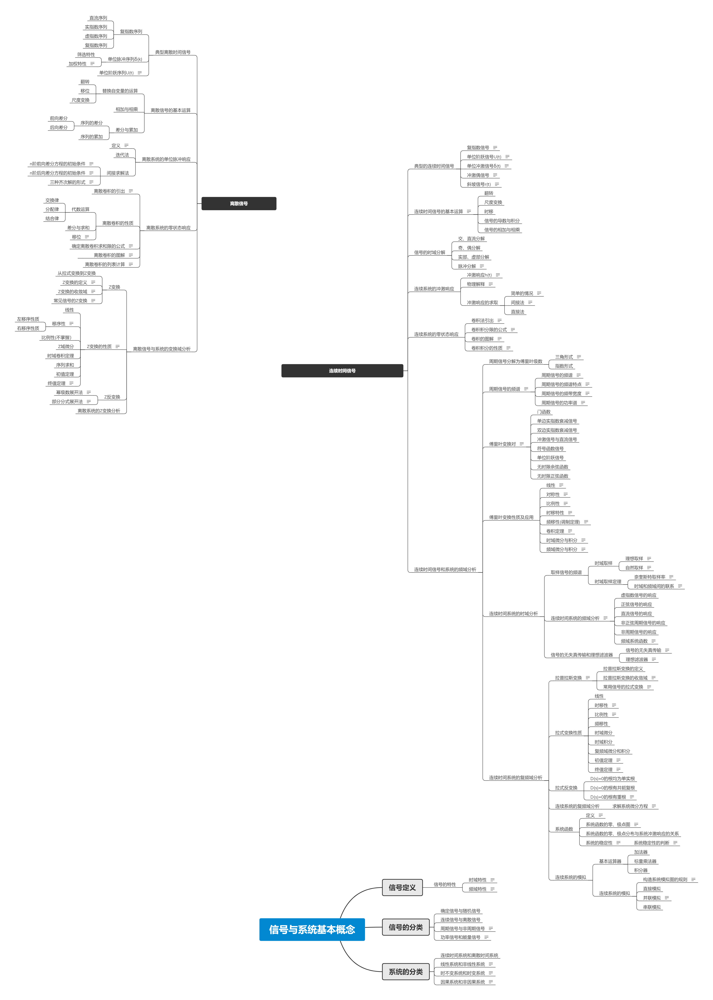

# 疫情前

[COVID-19 疫情](https://en.wikipedia.org/wiki/COVID-19)前我还不会 git，但是也有零星的笔记。

| code | 学期   |
| ---- | ------ |
| 1    | 大一上 |
| 2    | 大一下 |
| 3    | 大二上 |

## xmind 思维导图

### 高数下

<!-- [png](2高数下/高数下.png) [xmind](2高数下/高数下.xmind) -->

### 近现代史

<!-- [png](2中国近现代史/中国近现代史.png) [xmind](2中国近现代史/中国近现代史.png) -->

### 模拟电子电路

<!-- [png](3模拟电子电路/模拟电子电路.png) [xmind](3模拟电子电路/模拟电子电路.png) -->

### 信号与系统分析

